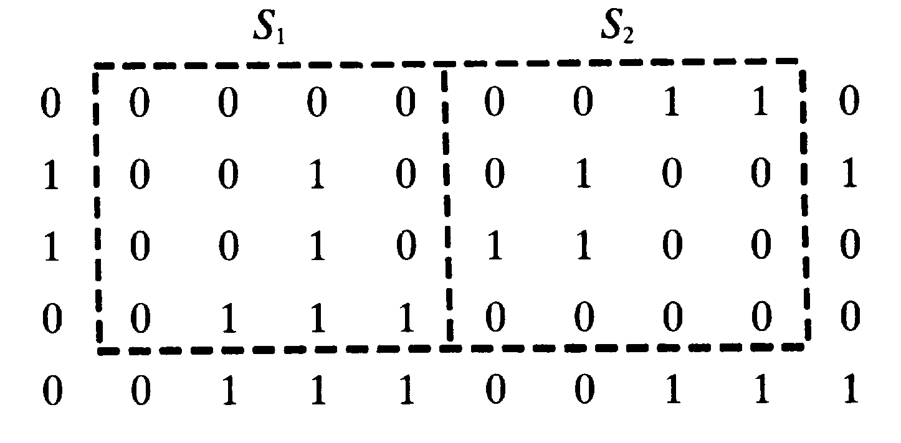
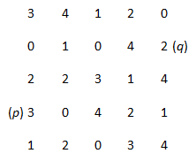
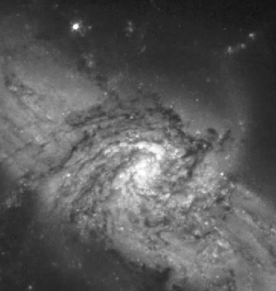
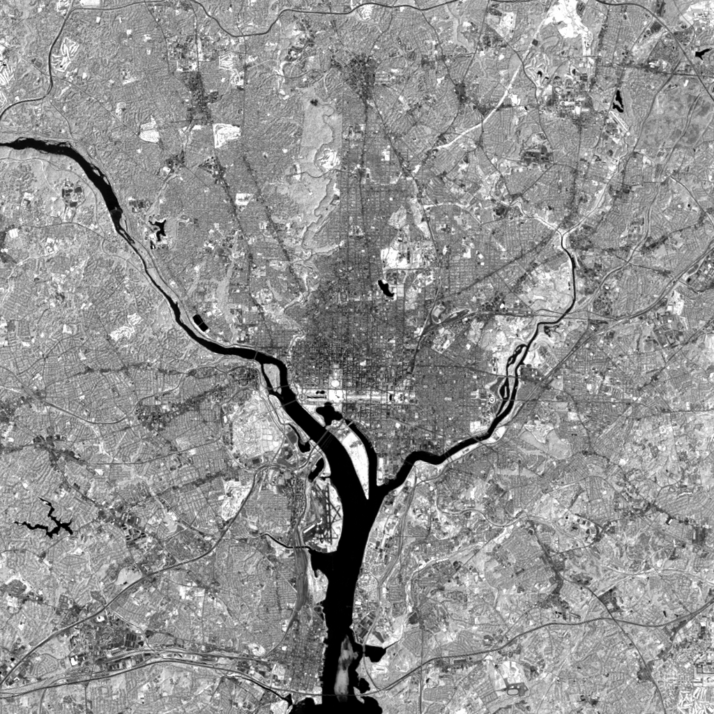
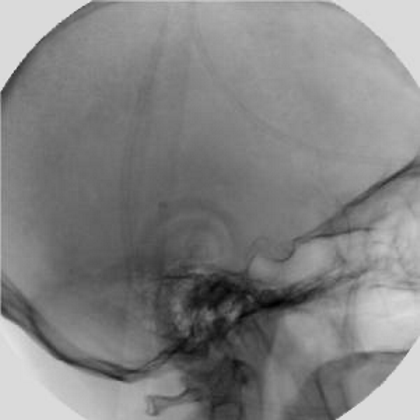
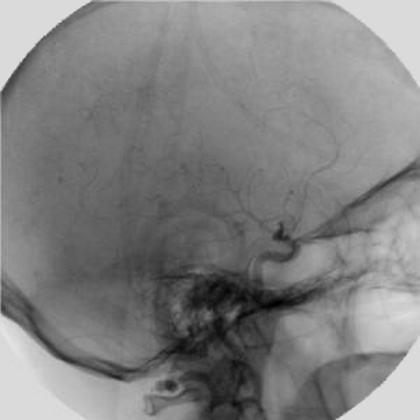
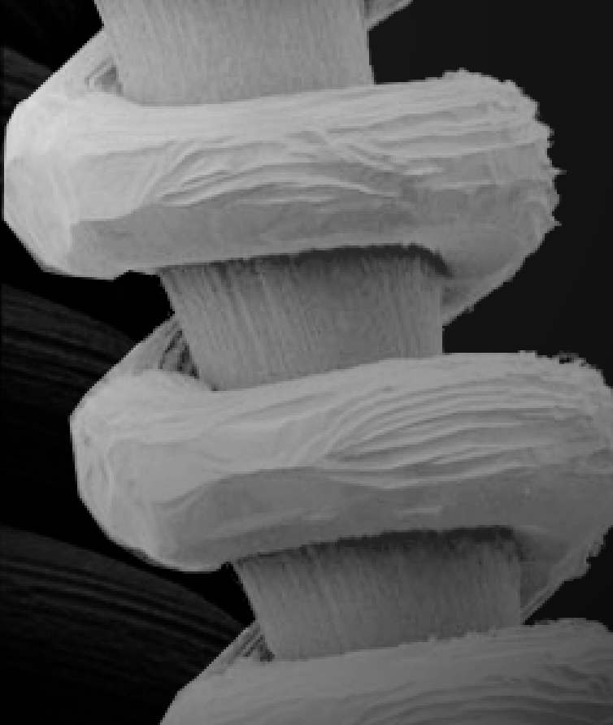
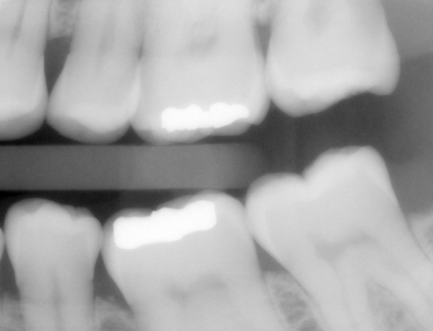
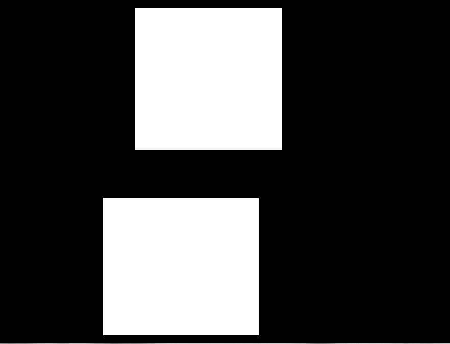
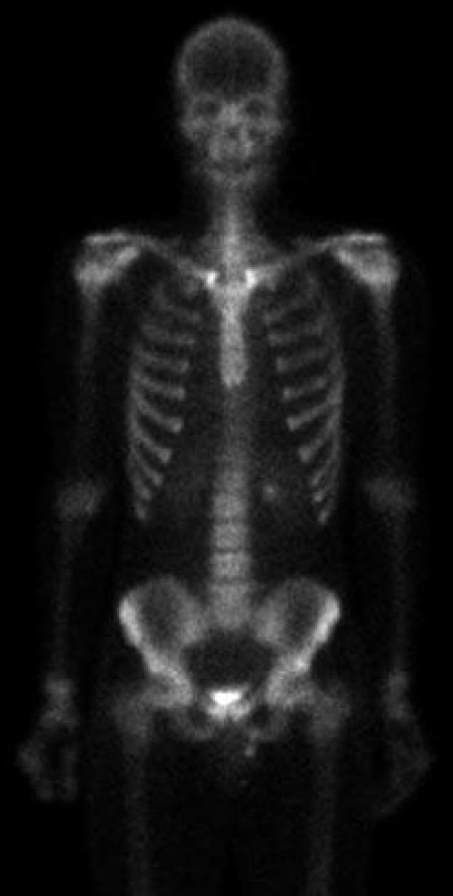

<b>数字图像处理及应用 第１次作业</b>

<b>组号： <u>16</u>&emsp;小组成员： <u>冯坤龙 辛梓阳 郝锦阳 朱从庆 徐振良</u></b>

<b>Part I Exercises</b>

***

**Ex.1** You are preparing a report and have to insert in it an image of size $2048\times2048$ pixels.
(a) Assuming no limitations on the printer, what would the resolution in line pairs per mm have to be for the image to fit in a space of size $5\times5$ cm?
(b) What would the resolution have to be in dpi for the image to fit in $2\times2$ inches?

**Answer:**

(a) $\dfrac{2048\ dots}{2\times50\ mm}=20.48\ lp/mm $

(b) mamashangde

***

**Ex.2** A CCD camera chip of dimensions $14\times14$ mm, and having $2048\times2048$ elements, is focused on a square, flat area, located 0.5 m away. How many line pairs per mm will this camera be able to resolve? The camera is equipped with a 35-mm lens. (Hint: Model the imaging process as in Fig. 2.3, with the focal length of the camera lens substituting for the focal length of the eye.)

**Answer:**

***

**Ex.3** Suppose that a flat area with center at ${(x_0, y_0)}$ is illuminated by a light source with intensity distribution
$$
i(x,y) = Ke^{-[(x-x_0)^2+(y-y_0)^2]}
$$

Assume for simplicity that the reflectance of the area is constant and equal to 1.0, and let K = 255. 

a) If the resulting image is digitized with $k$ bits of intensity resolution, and the eye can detect an abrupt change of eight shades of intensity between adjacent pixels, what value of $k$ will cause visible false contour? 

b) Sketch the image for $k=4$.

**Answer:**

***

**Ex.4** Consider the two image subsets, $S_1$ and $S_2$ shown in the following figure. For $V=\{1\}$, determine whether these two subsets are (a) 4-adjacent, (b) 8-adjacent, or (c) m-adjacent.

**Answer:**

***

**Ex.5** Develop an algorithm for converting a one-pixel-thick m-path to a 4-path. Explain the principle and give the algorithm flow chart or pseudo code.

**Answer:**

***

**Ex.6** Consider the image segment shown.

(a) Let $V=\{0,1,2\}$ and compute the lengths of the shortest 4-, 8-, and m-path between *p* and *q*. If a particular path does not exist between these two points, explain why.

(b) Repeat for  $V=\{2,3,4\}$. 

You just need to give one possible path for each type of path, and sketch one path on 

**Answer:**

***

**Ex.7** Prove the validity of Eqs. (2.6-6) and (2.6-7). [Hint: Start with Eq. (2.6-4) and use the fact that the expected value of a sum is the sum of the expected values.]

**Answer:**

***

**Ex.8**  Consider two 8-bit images whose intensity levels span the full range from 0 to 255.
(a) Discuss the limiting effect of repeatedly subtracting image (2) from image (1). Assume that the result is represented also in eight bits.
(b) Would reversing the order of the images yield a different result?

**Answer:**

***

**Ex.9** Prove that the Fourier kernels in Eqs. (2.6-34) and (2.6-35) are separable and symmetric. What are the advantage of using separable transformations on images?

**Answer:**

**Ex.10** We know from Eq. (2.6-23) that an affine transformation of coordinates is given by
$$
\begin{equation}
	\left[ {\begin{array}{*{20}{c}}
	{x'}\\
	{y'}\\
	1
	\end{array}} \right] = {\bf{A}}\left[ {\begin{array}{*{20}{c}}
	x\\
	y\\
	1
	\end{array}} \right] = \left[ {\begin{array}{*{20}{c}}
	{{a_{11}}}&{{a_{12}}}&{{a_{13}}}\\
	{{a_{21}}}&{{a_{22}}}&{{a_{23}}}\\
	0&0&1
	\end{array}} \right]\left[ {\begin{array}{*{20}{c}}
	x\\
	y\\
	1
	\end{array}} \right]
\end{equation}
$$

where $(x', y')$ are the are the transformed coordinates, $(x, y)$ are the original coordinates, and the elements of $\bold{A}$ are given in Table 2.2 for various types of transformations. The inverse transformation, $\bold{A^{-1}}$, to go from the transformed back to the original coordinates is just as important for performing inverse mappings.

(a) Find the inverse scaling transformation.
(b) Find the inverse translation transformation.
(c) Find the inverse vertical and horizontal shearing transformations.
(d) Find the inverse rotation transformation.
(e) Show a composite inverse translation/rotation transformation.

<b>Part II Programming</b>

***

**Example 2.5**  For a noisy image which contains Gaussian noise with stand deviation $\sigma = 64$ gray levels and mean $\mu = 0$, observing noise reduction effects by  adding (averaging) *k* noisy images, and *k* takes 5, 10, 20, 50, and 100 respectively. 

 <b>the original image without noise</b>

(*followed by **Matlab live Scripts** or **Jupyter Scripts** and running results*)

***

**Example 2.6**  Image subtraction for enhancing differences. 

1) Firstly, set zero the least-significant bit of the image shown, and then subtract the result image from the original one to show the differences between them.

<b> the original image</b>

2) Digital subtraction angiography.

<table frame=void><tr>
    <td style="border: none;">

</td>
    <td style="border: none;">

</td>
    </tr></table>

(*followed by **Matlab live Scripts** or **Jupyter Scripts** and running results*)

***

**Example 2.7**  Image multiplication and division

1) If the shading pattern has been estimated from the original image, try to correct the shading by using image multiplication or division. 

<table frame=void><tr>
    <td style="border: none;">

</td>
    <td style="border: none;">

</td>
    </tr></table>

The left image is the original image, and the right one is the shading pattern of the original image.

2) Extraction of ROIs by using mask.

<table frame=void><tr>
    <td style="border: none;">

</td>
    <td style="border: none;">

</td>
    </tr></table>

(*followed by **Matlab live Scripts** or **Jupyter Scripts** and running results*)

***

**Example 2.8**  Let the elements of a gray-scale image be represented by a set A whose elements are triplets of the form $(x,y,z)$, where $x$ and $y$ are spatial coordinates and $z$ denotes intensity. 

1) Show the complement of A according to $A^c=\{(x,y,K-z)|(x,y,z)\in A\}$.

2) Suppose image B is a constant image whose size is same as image A, and the value of its elements is 3 times the mean intensity of image A. Show the union of A and B, with the union of A and B defined by $A\cup B = \{\underset{z} {max}(a,b)|a\in A, b\in B\}$.  

 <b>the original image</b>

(*followed by **Matlab live Scripts** or **Jupyter Scripts** and running results*)

