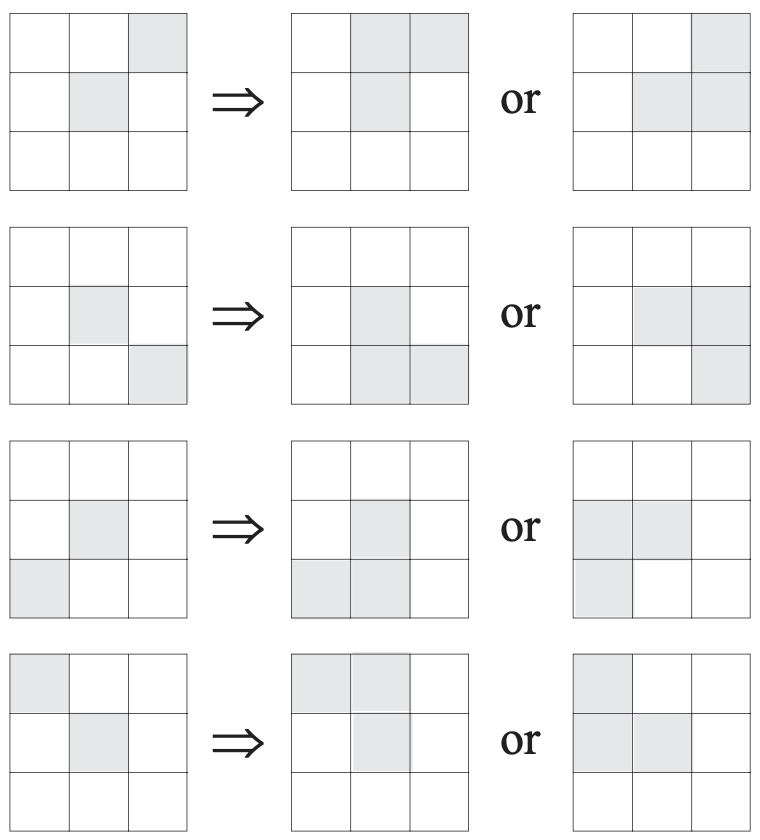
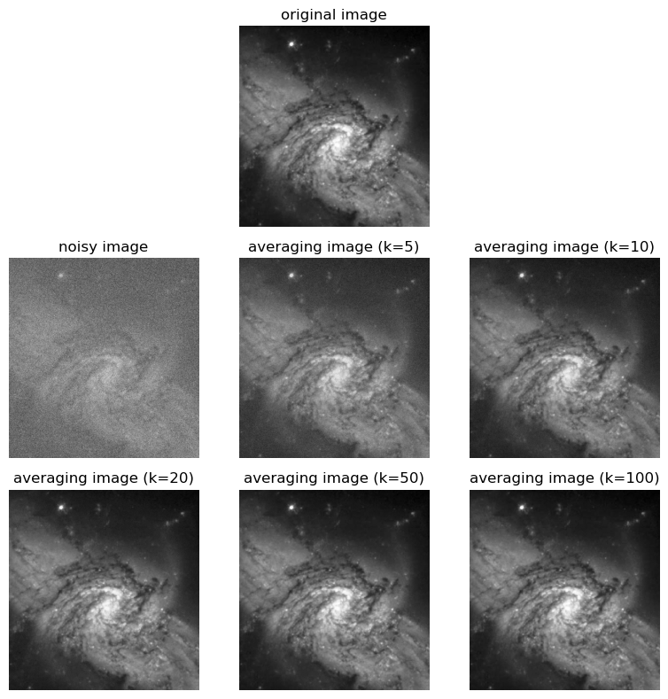
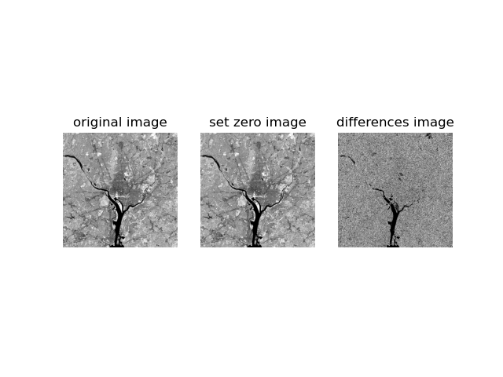
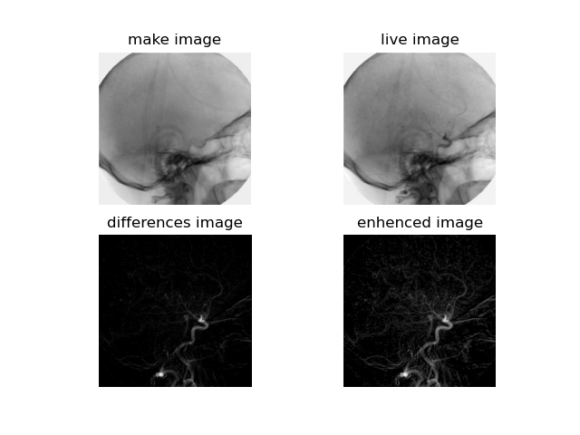
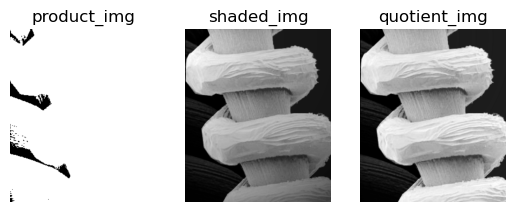
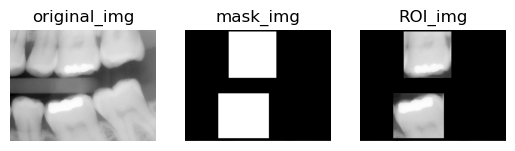
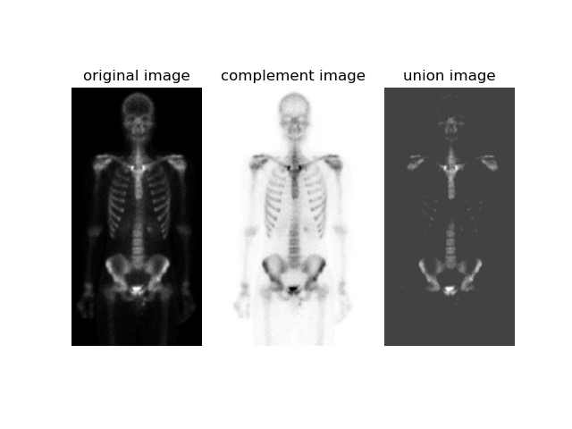

<center><font face="微软雅黑" size=5 color=red><b>数字图像处理及应用 第１次作业</b></font></center>

<center><font face=“微软雅黑" size=4 color = blue><b>组号： <u>16</u>&emsp;小组成员： <u>冯坤龙 辛梓阳 郝锦阳 朱从庆 徐振良</u></b></font></center>


<font face = "微软雅黑" size= 5><b>Part I Exercises</b></font>

***

**Ex.1** You are preparing a report and have to insert in it an image of size $2048\times2048$ pixels.
(a) Assuming no limitations on the printer, what would the resolution in line pairs per mm have to be for the image to fit in a space of size $5\times5$ cm?
(b) What would the resolution have to be in dpi for the image to fit in $2\times2$ inches?

**Answer:**

(a) 20.48  lp/mm. 

Line width $w$:  
$$
w = \dfrac{5\ cm}{2048\ dots} = \dfrac{50\ mm}{2048\ dots}
$$
The resolution $R$:
$$
\begin{aligned}
R &= \dfrac{1}{2w}\\
  &= \dfrac{1}{2}\times\dfrac{2048\ dots}{50\ mm}\\
  &= 20.48\ lp/mm
\end{aligned}
$$

(b) 1024 dpi.
$$
\sqrt{\dfrac{2048\times2048\ dots}{2\ inches\times2\ inches}}=1024\ dpi\ (dots\ per \ inch)
$$

***

**Ex.2** A CCD camera chip of dimensions $14\times14$ mm, and having $2048\times2048$ elements, is focused on a square, flat area, located 0.5 m away. How many line pairs per mm will this camera be able to resolve? The camera is equipped with a 35-mm lens. (Hint: Model the imaging process as in Fig. 2.3, with the focal length of the camera lens substituting for the focal length of the eye.)

**Answer:** 5.12 lp/mm

Suppose $H$ is real height of the subject, according to geometry:
$$
\dfrac{H}{0.5\ m}=\dfrac{14\ mm}{35\ mm}\Rightarrow H=0.2\ m
$$
Using 2048 elements (dots) for capturing one line, the line width $w$ shall be: 
$$
w = \dfrac{0.2\ m}{2048\ dots} = \dfrac{200\ mm}{2048\ dots}
$$
The resolution $R$:
$$
\begin{aligned}
R &= \dfrac{1}{2w}\\
  &= \dfrac{1}{2}\times\dfrac{2048\ dots}{200\ m}\\
  &= 5.12\ lp/mm
\end{aligned}
$$


***

**Ex.3** Suppose that a flat area with center at ${(x_0, y_0)}$ is illuminated by a light source with intensity distribution
$$
i(x,y) = Ke^{-[(x-x_0)^2+(y-y_0)^2]}
$$

Assume for simplicity that the reflectance of the area is constant and equal to 1.0, and let K = 255. 

a) If the resulting image is digitized with $k$ bits of intensity resolution, and the eye can detect an abrupt change of eight shades of intensity between adjacent pixels, what value of $k$ will cause visible false contour? 

b) Sketch the image for $k=4$.

**Answer:**

a) An image could be described by $f(x,y) = i(x,y)\ r(x,y)$, where $i(x,y)$ denotes illumination components, $r(x,y)$ denotes reflectance components. Given that:
$$
\begin{aligned}
i(x,y) &= 255e^{-[(x-x_0)^2+(y-y_0)^2]}\\
r(x,y) &= 1.0
\end{aligned}
$$

$$
\begin{aligned}
\Rightarrow f(x,y) &= 255e^{-[(x-x_0)^2+(y-y_0)^2]} \times 1.0 \\
f(x,y) &= 255e^{-[(x-x_0)^2+(y-y_0)^2]}\qquad (x,y\in N,\ N = \{ 0,1,2 \dots \})
\end{aligned}
$$

Obviously, the maximum and minimum value of $f(x,y)$ is 255 and 0. Suppose $f(x,y)$ digitized with $k$ bits of intensity resolution, abrupt change  in intensity is $\Delta I$. 
$$
\Delta I = \dfrac{255+1}{2^k}
$$
Assuming $\Delta I = 8$,
$$
\begin{aligned}
\dfrac{255+1}{2^k} &= 8\\
               2^k &= 32\\
                 k &= 5
\end{aligned}
$$
As a result, visible false contour will be caused when $k \le 5$.

b)

***

**Ex.4** Consider the two image subsets, $S_1$ and $S_2$ shown in the following figure. For $V=\{1\}$, determine whether these two subsets are (a) 4-adjacent, (b) 8-adjacent, or (c) m-adjacent.

<div align=center></div>

**Answer:**

(a) They are not 4-adjacent since there is no 4-path.

(b) They are 8-adjacent since there is a 8-path.

(c) They are 8-adjacent since there is a m-path.


***

**Ex.5** Develop an algorithm for converting a one-pixel-thick m-path to a 4-path. Explain the principle and give the algorithm flow chart or pseudo code.

**Answer:**

Find alll m-paths of the pixel *p*, convert its corresponding neighbours to fit for a 4-path.



***

**Ex.6** Consider the image segment shown.

<div align=center></div>

(a) Let $V=\{0,1,2\}$ and compute the lengths of the shortest 4-, 8-, and m-path between *p* and *q*. If a particular path does not exist between these two points, explain why.

(b) Repeat for  $V=\{2,3,4\}$. 

You just need to give one possible path for each type of path, and sketch one path on 

**Answer:**

(a) When $V=\{0,1,2\}$, there is no 4-, 8- and m-path between p and q, since the intensity of p $3 \notin V$.

(b) When $V=\{2,3,4\}$, there is no 4-path between p and q; the lengths of the shortest 8- and m-path between *p* and *q* is 4 and 5, respectively. Sketches are as follows.

 8-path.pdf)

 m-path.pdf)

***

**Ex.7** Prove the validity of Eqs. (2.6-6) and (2.6-7). [Hint: Start with Eq. (2.6-4) and use the fact that the expected value of a sum is the sum of the expected values.]

**Answer:**
$$
\begin{aligned}
					 g(x,y) &= f(x,y) + \eta(x,y) \\
\overline{g}(x,y) &= \dfrac{1}{K} \sum_{i=1}^{K}{g_i(x,y)} \\
\end{aligned}
$$
$$
\begin{aligned}
\Rightarrow E\left[\overline{g}(x,y)\right] 
&= E\left[ \dfrac{1}{K} \sum_{i=i}^K g_i(x,y) \right] \\
&= E\left[ \dfrac{1}{K} \sum_{i=i}^K f_i(x,y) + \eta_i(x,y)\right] \\
&= \dfrac{1}{K} E\left[ \dfrac{1}{K} \sum_{i=i}^K f_i(x,y) \right] +
	 \dfrac{1}{K} E\left[ \dfrac{1}{K} \sum_{i=i}^K \eta_i(x,y) \right] \\
&= f(x,y)
\end{aligned}
$$

$$
\begin{aligned}
\sigma^2 \left[\overline{g}(x,y)\right]
&= \sigma^2 \left[\dfrac{1}{K} \sum_{i=1}^{K}{g_i(x,y)}\right] \\
&= \dfrac{1}{K^2} \sigma^2 \left[\sum_{i=1}^{K}(f_i(x,y) + \eta_i(x,y))\right] \\
&= \dfrac{1}{K^2} \sigma^2 \left[\sum_{i=1}^{K}f_i(x,y)\right] +
   \dfrac{1}{K^2} \sigma^2 \left[\sum_{i=1}^{K}\eta_i(x,y)\right] \\
&= \dfrac{1}{K^2} \sigma^2_\eta
\end{aligned}
$$


***

**Ex.8**  Consider two 8-bit images whose intensity levels span the full range from 0 to 255.
(a) Discuss the limiting effect of repeatedly subtracting image (2) from image (1). Assume that the result is represented also in eight bits.
(b) Would reversing the order of the images yield a different result?

**Answer:**

(a) Pixels are integer values, and 8 bits allow representation of 256 contiguous integer values. In our work,the range of intensity values for 8-bit images is [0,255].The subtraction of values in this range cover the range [-255,255]. This range of values cannot be covered by 8 bits, but it is given in the problem statement that the result of subtraction has to be represented in 8 bits also, and, consistent with the range of values used for 8-bit images throughout the book, we assume that values of the 8-bit difference images are in the range [0,255].What this means is that any subtraction of 2 pixels that yields a negative quantity will be clipped at 0.The process of repeated subtractions of an image $b(x,y)$ from an image $a(x,y)$ can be expressed as
$$
d(x,y)=a(x,y)-\sum_{k=1}^Kb(x,y)=a(x,y)-K\times b(x,y).
$$
where $d(x, y)$ is the difference image resulting after K subtractions. Because image subtraction is an array operation (see Section 2.6.1), we can focus attention on the subtraction of any corresponding pair of pixels in the images. We have already stated that negative results are clipped at 0. Once a 0 result is obtained, it will remain so because subtraction of any nonnegative value from 0 is a negative quantity which, again, is clipped at 0. Similarly, any location $(x_0,y_0)$ for which $b(x_0,y_0)=0$, will produce the result $d(x_0,y_0)=a(x_0,y_0)$. That is, repeatedly subtracting 0 from any value results in that value. The locations in $b(x,y)$ that are not 0 will eventually decrease the corresponding values in $d(x,y)$ until they are 0. The maximum number of subtractions in which this takes place in the context of the present problem is 255, which corresponds to the condition at a location in which $a(x,y)$ is 255 and $b(x,y)$ is 1. Thus, we conclude from the preceding discussion that repeatedly subtracting an image from another will result in a different image whose components are 0 in the locations in $b(x,y)$ that are not zero and equal to the original values of $a(x,y)$ at the locations in $b(x,y)$ that are 0. This result will be achieved in, at most, 255 subtractions.

(b) The order does matter. For example, suppose that at a pair of arbitrary coordinates, $(x_0,y_0)$,
$a(x_0,y_0) =128$ and $b(x_0,y_0) =0$. Subtracting $b(x_0,y_0)$ from $a(x_0,y_0)$ will result in $d(x_0,y_0)=128$ in the limit. Reversing the operation will result in a value of 0 in that same location.

***

**Ex.9** Prove that the Fourier kernels in Eqs. (2.6-34) and (2.6-35) are separable and symmetric. What are the advantage of using separable transformations on images?

**Answer:**

As
$$
\begin{aligned}
r(x,y,u,v) &= e^{-j2 \pi (\frac{ux}{M}+\frac{vy}{N})}\\
					 &= e^{-j2 \pi (\frac{ux}{M})}e^{-j2 \pi (\frac{vy}{N})}\\
					 &= r_1(x,u)r_2(y,v)	
\end{aligned}
$$
we could say that the Fourier transformation kernel is separable.

Since
$$
\begin{aligned}
e^{-j2 \pi (\frac{ux}{M}+\frac{vy}{N})} &= e^{-j2 \pi (\frac{ux}{M})}\\
					 															&= r_1(x,u)r_1(y,v)
\end{aligned}
$$
it is symmetric.

**Ex.10** We know from Eq. (2.6-23) that an affine transformation of coordinates is given by
$$
\begin{equation}
	\left[ {\begin{array}{*{20}{c}}
	{x'}\\
	{y'}\\
	1
	\end{array}} \right] = {\bf{A}}\left[ {\begin{array}{*{20}{c}}
	x\\
	y\\
	1
	\end{array}} \right] = \left[ {\begin{array}{*{20}{c}}
	{{a_{11}}}&{{a_{12}}}&{{a_{13}}}\\
	{{a_{21}}}&{{a_{22}}}&{{a_{23}}}\\
	0&0&1
	\end{array}} \right]\left[ {\begin{array}{*{20}{c}}
	x\\
	y\\
	1
	\end{array}} \right]
\end{equation}
$$


where $(x', y')$ are the are the transformed coordinates, $(x, y)$ are the original coordinates, and the elements of $\bold{A}$ are given in Table 2.2 for various types of transformations. The inverse transformation, $\bold{A^{-1}}$, to go from the transformed back to the original coordinates is just as important for performing inverse mappings.

(a) Find the inverse scaling transformation.
(b) Find the inverse translation transformation.
(c) Find the inverse vertical and horizontal shearing transformations.
(d) Find the inverse rotation transformation.
(e) Show a composite inverse translation/rotation transformation.

**Answer:**

(a) The inverse scaling transformation
$$
\mathbf{A^{-1}} = \left(
\begin{array}{cccc}
\frac{1}{C_{x}}& 0 & 0\\
0&\frac{1}{C_{y}}&0\\

0 & 0 & 1\\
\end{array}
\right)
$$
(b) The inverse translation transformation
$$
\mathbf{A^{-1}} = \left(
\begin{array}{cccc}
1& 0 & 0\\
0&1&0\\

-t_{x}& -t_{y} & 1\\
\end{array}
\right)
$$
(c) The inverse vertical and horizontal shearing transformations
$$
\mathbf{A_v^{-1}} = \left(
\begin{array}{cccc}
1& 0 & 0\\
-S_{v}&1&0\\

0& 0& 1\\
\end{array}
\right)

\\\\

\mathbf{A_h^{-1}} = \left(
\begin{array}{cccc}
1& -S_{h}& 0\\
0&1&0\\

0& 0& 1\\
\end{array}
\right)
$$
(d) The inverse rotation transformation
$$
\mathbf{A^{-1}} = \left(
\begin{array}{cccc}
cos\theta& -sin\theta& 0\\
sin\theta&cos\theta&0\\

0& 0& 1\\
\end{array}
\right)
$$
(e) A composite inverse translation/rotation transformation
$$
\mathbf{A^{-1}} = \left(
\begin{array}{cccc}
cos\theta& -sin\theta& 0\\
sin\theta&cos\theta&0\\

-t_{x}& -t_{y}& 1\\
\end{array}
\right)
$$

<div STYLE="page-break-after: always;"></div>

<font face = "微软雅黑"  size= 5><b>Part II Programming</b></font>

***

**Example 2.5**  For a noisy image which contains Gaussian noise with stand deviation $\sigma = 64$ gray levels and mean $\mu = 0$, observing noise reduction effects by adding (averaging) *k* noisy images, and *k* takes 5, 10, 20, 50, and 100 respectively. 

<div align=center></div>

<center> <b>the original image without noise</b></center>

(*followed by **Matlab live Scripts** or **Jupyter Scripts** and running results*)

<center>Jupyter Scripts</center>

Import Dependencies.


```python
import cv2
import matplotlib.pyplot as plot
import numpy as np
```

Define function *gauss_noise()* to generate a corresponding Gaussian noise.


```python
def gauss_noise(mean, stand_deviation, shape):
    noise = np.random.normal(mean, stand_deviation, shape)
    return noise
```

Define function *noisy_image_average()* to generate an averaging image.


```python
def noisy_image_average(mean, stand_deviation, img, k):
    g = np.zeros(img.shape)
    for i in range(k):
        g += gauss_noise(mean, stand_deviation, img.shape)
        g /= k
    averaging_img = img + g
    return averaging_img
```

Load the original image without noise.


```python
original_img = cv2.imread('../images/Fig0226(galaxy_pair_original).png', flags=0)
```

Generate Gaussian noise and add it to the original image.


```python
Gauss_Noise = gauss_noise(0, 64, original_img.shape)
noisy_img = original_img + Gauss_Noise
```

Generate averaging image for k = 5, 10, 20, 50 and 100, respectively.


```python
averaging_img_5 = noisy_image_average(0, 64, original_img, 5)
averaging_img_10 = noisy_image_average(0, 64, original_img, 10)
averaging_img_20 = noisy_image_average(0, 64, original_img, 20)
averaging_img_50 = noisy_image_average(0, 64, original_img, 50)
averaging_img_100 = noisy_image_average(0, 64, original_img, 100)
```

Display the results.


```python
plot.figure(figsize=(8, 8))
plot.subplot(332), plot.imshow(original_img, cmap='gray'), plot.title('original image'), plot.axis('off')
plot.subplot(334), plot.imshow(noisy_img, cmap='gray'), plot.title('noisy image'), plot.axis('off')
plot.subplot(335), plot.imshow(averaging_img_5, cmap='gray'), plot.title('averaging image (k=5)'), plot.axis('off')
plot.subplot(336), plot.imshow(averaging_img_10, cmap='gray'), plot.title('averaging image (k=10)'), plot.axis('off')
plot.subplot(337), plot.imshow(averaging_img_20, cmap='gray'), plot.title('averaging image (k=20)'), plot.axis('off')
plot.subplot(338), plot.imshow(averaging_img_50, cmap='gray'), plot.title('averaging image (k=50)'), plot.axis('off')
plot.subplot(339), plot.imshow(averaging_img_100, cmap='gray'), plot.title('averaging image (k=100)'), plot.axis('off')
plot.tight_layout()
plot.show()
```

<center>Runnning Results</center>



***

**Example 2.6**  Image subtraction for enhancing differences. 

1) Firstly, set zero the least-significant bit of the image shown, and then subtract the result image from the original one to show the differences between them.

<div align=center></div>

<center><b> the original image</b></center>

2) Digital subtraction angiography.

<table frame=void><tr>
    <td style="border: none;"><div align=center></div></td>
    <td style="border: none;"><div align=center></div></td>
    </tr></table>
**1.**

<center>Jupyter Scripts</center>

Import Dependencies.


```python
import cv2
import matplotlib.pyplot as plot
import numpy as np
```

 Load the original image as gray.


```python
original_img = cv2.imread('../images/Fig0227(a)(washington_infrared).png', flags=0)
```

Generate one 8-bit ndarray with all element values of 1111_1110B as the same shape as the original image, set its data type to *np.uint8*.


```python
set_zero_ndarray = np.ones(original_img.shape, dtype=np.uint8) * 0b1111_1110
```

Conduct bitwisen and operation, assign the result to variable set_img.


```python
set_img = cv2.bitwise_and(original_img, set_zero_ndarray)
```

Generate the difference image and extend it.


```python
diff_img = (original_img - set_img) * 0b1111_1111
```

Display the results.


```python
plot.subplot(131), plot.imshow(original_img, cmap='gray'), plot.title('original image'), plot.axis('off')
plot.subplot(132), plot.imshow(set_img, cmap='gray'), plot.title('set zero image'), plot.axis('off')
plot.subplot(133), plot.imshow(diff_img, cmap='gray'), plot.title('differences image'), plot.axis('off')
plot.savefig('../images/Result Example 2.6.1.png')
plot.show()

```



**2.**

<center>Jupyter Scripts</center>

Import Dependencies.


```python
import cv2
import matplotlib.pyplot as plot
import numpy as np
```

 Load the images as gray.


```python
mask_img = cv2.imread('../images/Fig0228(a)(angiography_mask_image).png', flags=0)
live_img = cv2.imread('../images/Fig0228(b)(angiography_live_image).png', flags=0)
```

Obtain the differences between mask image and live image, using function *cv2.substract()*.


```python
diff_img = cv2.subtract(mask_img, live_img)
```

Enhence the differences image, adjusting gamma.


```python
enhenced_img = diff_img / 255.0
enhenced_img = np.power(enhenced_img, 0.7)
enhenced_img *= 255
```

Display the results.


```python
plot.subplot(221), plot.imshow(mask_img, cmap='gray'), plot.title('make image'), plot.axis('off')
plot.subplot(222), plot.imshow(live_img, cmap='gray'), plot.title('live image'), plot.axis('off')
plot.subplot(223), plot.imshow(diff_img, cmap='gray'), plot.title('differences image'), plot.axis('off')
plot.subplot(224), plot.imshow(enhenced_img, cmap='gray'), plot.title('enhenced image'), plot.axis('off')
plot.savefig('../images/Results Example 2.6.2.png')
plot.show()

```




(*followed by **Matlab live Scripts** or **Jupyter Scripts** and running results*)


***

**Example 2.7**  Image multiplication and division

1) If the shading pattern has been estimated from the original image, try to correct the shading by using image multiplication or division. 

<table frame=void><tr>
    <td style="border: none;"><div align=center></div></td>
    <td style="border: none;"><div align=center></div></td>
    </tr></table>


The left image is the original image, and the right one is the shading pattern of the original image.

2) Extraction of ROIs by using mask.

<table frame=void><tr>
    <td style="border: none;"><div align=center></div></td>
    <td style="border: none;"><div align=center></div></td>
    </tr></table>


(*followed by **Matlab live Scripts** or **Jupyter Scripts** and running results*)

<center> Jupyter Scripts </center>

**1.**

Import Dependencies.


```python
import cv2
import matplotlib.pyplot as plot
```

Load the shaded image and the shading pattern.


```python
shaded_img = cv2.imread(
    'images/Fig0229(a)(tungsten_filament_shaded).png',
    flags=0)
shading_pattern = cv2.imread(
    'images/Fig0229(b)(tungsten_sensor_shading).png',
    flags=0)
```

Perform multiplication and division for images by using *cv2.multiply()* and *cv2.divide()*.


```python
product_img = cv2.multiply(shaded_img, shading_pattern, scale=256)
quotient_img = cv2.divide(shaded_img, shading_pattern, scale=256)
```

Display the results.


```python
plot.subplot(132), plot.imshow(shaded_img, cmap='gray'), plot.title('shaded_img'), plot.axis('off')
plot.subplot(131), plot.imshow(product_img, cmap='gray'), plot.title('product_img'), plot.axis('off')
plot.subplot(133), plot.imshow(quotient_img, cmap='gray'), plot.title('quotient_img'), plot.axis('off')
plot.show()

```




**2.**

Import dependencies.


```python
import cv2
import matplotlib.pyplot as plot
```

Load the original image and mask image.


```python
original_img = cv2.imread('images/Fig0230(a)(dental_xray).png', flags=0)
mask_img = cv2.imread('images/Fig0230(b)(dental_xray_mask).png', flags=0)
```

Perform the logic and operation to extract the region of interest (ROI) by function *cv2.bitwise_and()*


```python
ROI_img = cv2.bitwise_and(original_img, mask_img)
```

Display the results.


```python
plot.subplot(131), plot.imshow(original_img, cmap='gray'), plot.title('original_img'), plot.axis('off')
plot.subplot(132), plot.imshow(mask_img, cmap='gray'), plot.title('mask_img'), plot.axis('off')
plot.subplot(133), plot.imshow(ROI_img, cmap='gray'), plot.title('ROI_img'), plot.axis('off')
plot.show()
```



***

**Example 2.8**  Let the elements of a gray-scale image be represented by a set A whose elements are triplets of the form $(x,y,z)$, where $x$ and $y$ are spatial coordinates and $z$ denotes intensity. 

1) Show the complement of A according to $A^c=\{(x,y,K-z)|(x,y,z)\in A\}$.

2) Suppose image B is a constant image whose size is same as image A, and the value of its elements is 3 times the mean intensity of image A. Show the union of A and B, with the union of A and B defined by $A\cup B = \{\underset{z} {max}(a,b)|a\in A, b\in B\}$.  

<div align=center></div>

<center> <b>the original image</b></center>

(*followed by **Matlab live Scripts** or **Jupyter Scripts** and running results*)

<center> Jupyter Scripts </center>

Import dependencies.


```python
import cv2
import numpy as np
import matplotlib.pyplot as plot
```

Load the images.


```python
original_img = cv2.imread('../images/Fig0232(a)(partial_body_scan).png')
complement_img = cv2.bitwise_not(original_img)
```

Generate a constant image whose size is same as the original image, and the value of its elements is 3 times the mean, intensity of the original image.


```python
constant_img = np.ones(shape=original_img.shape, dtype=np.uint8) * 3 * np.int8(np.mean(original_img))
```

Generate the union of the original image and the constant image.


```python
union_img = cv2.max(original_img, constant_img)
```

Display the results.


```python
plot.subplot(131), plot.imshow(original_img, cmap='gray'), plot.title('original image'), plot.axis('off')
plot.subplot(132), plot.imshow(complement_img, cmap='gray'), plot.title('complement image'), plot.axis('off')
plot.subplot(133), plot.imshow(union_img, cmap='gray'), plot.title('union image'), plot.axis('off')
plot.savefig('../images/Result Example 2.8.png')
plot.show()

```


