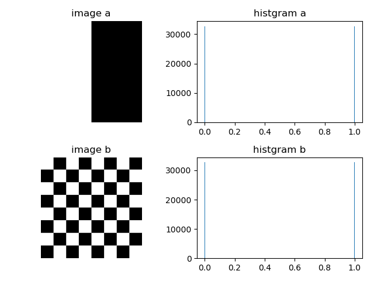

<center><font face="微软雅黑" size=5 color=red><b>数字图像处理及应用 第2次作业</b></font></center>

<center><font face=“微软雅黑" size=4 color = blue><b>组号： <u>16</u>&emsp;小组成员： <u>冯坤龙 郝锦阳 朱从庆 辛梓阳 徐振良</u></b></font></center>


<font face = "微软雅黑" size= 5><b>Part I Exercises</b></font>

***

**Ex.1** 

(**a**) Give a continuous function for implementing the contrast stretching transformation shown in **Fig. 3.2(a)**. In addition to $k$, your function must include a parameter, $E$, for controlling the slope of the function as it transitions from low to high intensity values. Your function should be normalized so that its minimum and maximum values are 0 and 1, respectively.
(**b**) Sketch a family of transformations as a function of parameter $E$, for a fixed value $m=L/4$ where $L$ is the number of intensity levels in the image.
(**c**) What is the smallest value of $E$ that will make your function effectively perform as the function in **Fig. 3.2(b)**? In other words, your function does not have to be identical to **Fig. 3.2(b)**. It just has to yield the same result of producing a binary image. Assume that you are working with 8-bit images, and let $k=128$. Let $C$ denote the smallest positive number representable in the computer you are using. 

<div align=center></div>

<div align=center><b>FIGURE 3.2 Intensity transformation functions</b></div>

**Answer:**


***

**Ex.2** 

An image with intensities in the range [0, 1] has the PDF $p_r{(r)}$ shown in the following diagram. It is desired to transform the intensity levels of this image so that they will have the specified $p_{z(z)}$ shown. Assume continuous quantities and find the transformation (in terms of $r$ and $z$) that will accomplish this.

<div align=center></div>

**Answer:**


***

**Ex.3** The implementation of linear spatial filters requires moving the center of a mask throughout an image and, at each location, computing the sum of products of the mask coefficients with the corresponding pixels at that location (see **Section 3.4**). A lowpass filter can be implemented by setting all coefficients to 1, allowing use of a so-called box-filter or moving-average algorithm, which consists of updating only the part of the computation that changes from one location to the next.

(**a**) Formulate such an algorithm for an $n\times n$ filter, showing the nature of the computations involved and the scanning sequence used for moving the mask around the image.

(**b**) The ratio of the number of computations performed by a brute-force implementation to the number of computations performed by the box-filter algorithm is called the *computational advantage*. Obtain the computational advantage in this case and plot it as a function of $n$ for $n > 1$. The $1/n^2$ scaling factor is common to both approaches, so you need not consider it in obtaining the computational advantage. Assume that the image has an outer border of zeros that is wide enough to allow you to ignore border effects in your analysis.

**Answer:**


***

**Ex.4** 
(**a**) Suppose that you filter an image, $f(x,y)$ , with a spatial filter mask, $w(x,y)$ , using convolution, as defined in **Eq. (3.4-2)**, where the mask is smaller than the image in both spatial directions. Show the important property that, if the coefficients of the mask sum to zero, then the sum of all the elements in the resulting convolution array (filtered image) will be zero also (you may ignore computational inaccuracies). Also, you may assume that the border of the image has been padded with the appropriate number of zeros.
$$
w(x,y)\bigstar f(x,y) = \sum_{s=-a}^{s=a} \sum_{t=-b}^{t=b}w(x,y)f(x-s,y-t) \tag{3.4-2}
$$

here, the symbol $\bigstar$ stands for convolution operation.

(**b**) Would the result to (a) be the same if the filtering is implemented using correlation, as defined in **Eq. (3.4-1)**?
$$
w(x,y)\otimes f(x,y) = \sum_{s=-a}^{s=a} \sum_{t=-b}^{t=b}w(x,y){f(x+s,y+t)} \tag{3.4-1}
$$
here, the symbol $\otimes$ stands for correlation operation.

**Answer:**


***

**Ex.5** Discuss the limiting effect of repeatedly filtering an image with a $3\times 3$ lowpass filter kernel. You may ignore border effects.

**Answer:**


***

**Ex.6** You are given the following kernel and image:
$$
w=\left [
\begin{matrix}
1 & 2 & 1 \\
2 & 4 & 2 \\
1 & 2 & 1 \\
\end{matrix}
\right ]
\qquad
f=\left [
\begin{matrix}
0 & 0 & 0 & 0 & 0\\
0 & 0 & 1 & 0 & 0\\
0 & 0 & 1 & 0 & 0\\
0 & 0 & 1 & 0 & 0\\
0 & 0 & 0 & 0 & 0\\
\end{matrix}
\right ]
$$
(**a**) By inspection, find two kernels, $w_1$ and $w_2$ so that $w=w_1\star w_2$. ($\star$ stands for convolution operation)

(**b**) Compute $w_1\star f$ using the minimum zero padding. Show the details of your computation when the kernel is centered at point (2, 3) (2nd row, 3rd col) of $f$ and then show the full convolution.

(**c**) Compute the convolution of $w_2$ with the result from (**b**). Show the details of your computation when the kernel is centered at point (3, 3) of the result from (b), and then show the full convolution. Compare with the result of $w\star f$.

**Answer:**

(a) 
$$
w_1 = w &= 
\begin{bmatrix}
1 & 2 & 1\\
2 & 4 & 2\\
1 & 2 & 1
\end{bmatrix}\\
w_2 &= 
\begin{bmatrix}
0 & 0 & 0\\
0 & 1 & 0\\
0 & 0 & 0
\end{bmatrix}\\
$$
(b) Minimum zero padding of $f$:
$$
f = 
\begin{bmatrix}
0	&	0	&	0	&	0	&	0	&	0	&	0	\\
0	&	0	&	0	&	0	&	0	&	0	&	0	\\
0	&	0	&	0	&	1	&	0	&	0	&	0	\\
0	&	0	&	0	&	1	&	0	&	0	&	0	\\
0	&	0	&	0	&	1	&	0	&	0	&	0	\\
0	&	0	&	0	&	0	&	0	&	0	&	0	\\
0	&	0	&	0	&	0	&	0	&	0	&	0	\\
\end{bmatrix}.
$$
Thus,
$$
\begin{array}{ll}

w_1\star f &=

\begin{bmatrix}
\cellcolor{yellow}1 & \cellcolor{yellow}2 & \cellcolor{yellow}1\\
\cellcolor{yellow}2 & \cellcolor{orange}4 & \cellcolor{yellow}2\\
\cellcolor{yellow}1 & \cellcolor{yellow}2 & \cellcolor{yellow}1
\end{bmatrix}

\star

\begin{bmatrix}
0	&	0	&	0	&	0	&	0	&	0	&	0	\\
0	&	0	&	\cellcolor{yellow}0	&	\cellcolor{yellow}0	&	\cellcolor{yellow}0	&	0	&	0	\\
0	&	0	&	\cellcolor{yellow}0	&	\cellcolor{orange}1	&	\cellcolor{yellow}0	&	0	&	0	\\
0	&	0	&	\cellcolor{yellow}0	&	\cellcolor{yellow}1	&	\cellcolor{yellow}0	&	0	&	0	\\
0	&	0	&	0	&	1	&	0	&	0	&	0	\\
0	&	0	&	0	&	0	&	0	&	0	&	0	\\
0	&	0	&	0	&	0	&	0	&	0	&	0	\\
\end{bmatrix}\\

&=

\begin{bmatrix}
0	&	1	&	2	&	1	&	0	\\
0	&	3	&	\cellcolor{orange}6	&	3	&	0	\\
0	&	4	&	8	&	4	&	0	\\
0	&	3	&	6	&	3	&	0	\\
0	&	1	&	2	&	1	&	0	\\
\end{bmatrix}.

\end{array}{}
$$
(c) 
$$
\begin{array}{ll}
w_2 \star (w_1\star f) &=
\begin{bmatrix}
\cellcolor{yellow}0 & \cellcolor{yellow}0 & \cellcolor{yellow}0\\
\cellcolor{yellow}0 & \cellcolor{orange}1 & \cellcolor{yellow}0\\
\cellcolor{yellow}0 & \cellcolor{yellow}0 & \cellcolor{yellow}0
\end{bmatrix}

\star

\begin{bmatrix}
0	&	1	&	2	&	1	&	0	\\
0	&	\cellcolor{yellow}3	& \cellcolor{yellow}6	&	\cellcolor{yellow}3	&	0	\\
0	&	\cellcolor{yellow}4	&	\cellcolor{orange}8	&	\cellcolor{yellow}4	&	0	\\
0	&	\cellcolor{yellow}3	&	\cellcolor{yellow}6	&	\cellcolor{yellow}3	&	0	\\
0	&	1	&	2	&	1	&	0	\\
\end{bmatrix}
=
\begin{bmatrix}
0	&	1	&	2	&	1	&	0	\\
0	&	3	&	6	&	3	&	0	\\
0	&	4	&	\cellcolor{orange}8	&	4	&	0	\\
0	&	3	&	6	&	3	&	0	\\
0	&	1	&	2	&	1	&	0	\\
\end{bmatrix}\\
&=
\begin{bmatrix}
0	&	0	&	0	&	0	&	0	&	0	&	0	\\
0	&	0	&	1	&	2	&	1	&	0	&	0	\\
0	&	0	&	3	&	6	&	3	&	0	&	0	\\
0	&	0	&	4	&	8	&	4	&	0	&	0	\\
0	&	0	&	3	&	6	&	3	&	0	&	0	\\
0	&	0	&	1	&	2	&	1	&	0	&	0	\\
0	&	0	&	0	&	0	&	0	&	0	&	0	\\
\end{bmatrix}\\
\\
w \star f = w_1 \star f &=
\begin{bmatrix}
0	&	1	&	2	&	1	&	0	\\
0	&	3	&	6	&	3	&	0	\\
0	&	4	&	8	&	4	&	0	\\
0	&	3	&	6	&	3	&	0	\\
0	&	1	&	2	&	1	&	0	\\
\end{bmatrix}

=w_2 \star (w_1\star f).
\end{array}{}
$$


***

**Ex.7**   In a character recognition application, text pages are reduced to binary using a thresholding transformation function of the form shown in following figure. 

<div align=center></div>

This is followed by a procedure that thins the characters until they become strings of binary 1’s on a background of 0’s. Due to noise, binarization and thinning result in broken strings of characters with gaps ranging from 1 to 3 pixels. One way to “repair” the gaps is to run a smoothing kernel over the binary image to blur it, and thus create bridges of nonzero pixels between gaps.

(**a**) Give the (odd) size of the smallest box kernel capable of performing this task.
(**b**) After bridging the gaps, the image is thresholded to convert it back to binary form. For your answer in (a), what is the minimum value of the threshold required to accomplish this, without causing the segments to break up again.

**Answer:**


***

**Ex.8** In the original image used to generate the three blurred images shown, the vertical bars are 5 pixels wide, 100 pixels high, and their separation is 20 pixels. The image was blurred using square box kernels of sizes 23, 25, and 45 elements on the side, respectively. The vertical bars on the left, lower part of (**a**) and (**c**) are blurred, but a clear separation exists between them. 

<table frame=void rules=none>
<tr>
    <td style="border:none;"><div align=center></div></td>
    <td style="border:none;"><div align=center></div></td>
    <td style="border:none; border-collapse:collapse;"><div align=center></div></td>
</tr>
<tr>
    <td style="border: none;"><div align=center>(<b>a</b>)</div></td>
    <td style="border: none;"><div align=center>(<b>b</b>)</div></td>
    <td style="border: none;"><div align=center>(<b>c</b>)</div></td>  
</tr>
</table>

However, the bars have merged in image (**b**), despite the fact that the kernel used to generate this image is much smaller than the kernel that produced image (**c**). Explain the reason for this.

**Answer:**


***

**Ex.9**  Consider an application such as the one shown in **Fig. 3.34**, in which it is desired to eliminate objects smaller than those enclosed by a square of size $q\times{} q$ pixels. Suppose that we want to reduce the average intensity of those objects to one-tenth of their original average value. In this way, those objects will be closer to the intensity of the background and they can then be eliminated by thresholding. Give the (odd) size of the smallest averaging mask that will accomplish the desired reduction in average intensity in only one pass of the mask over the image.

<div align=center></div>

<div align=center><b>FIGURE 3.34 Image from Hubble Space Telescope</b></div>

**Answer:**

In this area, we need up to $$q^2$$ points to reduce the average intensity of those objects to one-tenth of their original average value.At the same time I can conclude :the size of mask is larger than the $$q\times q$$ square neighborhood .Suppose the size of the filter mask is $$n\times n$$.The point set outside the object below the mask is called the background.

Suppose $$a_{i}$$、$$a_{j}$$ and $$a_{k}$$ respectively represent the intensity value of points in the mask、object and background. Thus,the response of the averaging mask at any point on the image is :

​                               $$R=\frac{1}{n^2}\sum\limits_{a_{i}\in A_{1}}a_{i}=\frac{1}{n^2}[\sum\limits_{a_{j}\in A_{2}}a_{j}+\sum\limits_{a_{k}\in A_{3}}a_{k}]                          $$                                       $$(1)$$

​                               $$=\frac{1}{n^2}[\frac{q^2}{q^2}\sum\limits_{a_{j}\in A_{2}}a_{j}]+\frac{1}{n^2}\sum\limits_{a_{k}\in A_{3}}a_{k}=\frac{q^2}{n^2}Q+\frac{1}{n^2}(n^2-q^2) \times S$$

$$A_{1}A_{2}A_{3}$$ respectively represent the pixel set of mask, object and background.S and Q represent the average intensity value of the background and object points respectively.
Let Equ.(1)<$$\frac{Q}{10}$$,I can get:

​                                                             $$n>q \times [\frac{10(Q-S)}{Q-10S}]^{0.5}$$

Therefore the size of the smallest averaging mask is $$q \times [\frac{10(Q-S)}{Q-10S}]^{0.5}$$.


***

**Ex.10**  A CCD TV camera is used to perform a long-term study by observing the same area 24 hours a day, for 30 days. Digital images are captured and transmitted to a central location every 5 minutes. The illumination of the scene changes from natural daylight to artificial lighting. At no time is the scene without illumination, so it is always possible to obtain an image. Because the range of illumination is such that it is always in the linear operating range of the camera, it is decided not to employ any compensating mechanisms on the camera itself. Rather, it is decided to use image processing techniques to postprocess, and thus normalize, the images to the equivalent of constant illumination. Propose a method to do this. You are at liberty to use any method you wish, but state clearly all the assumptions you made in arriving at your design.

**Answer:**


<div STYLE="page-break-after: always;"></div>

<font face = "微软雅黑"  size= 5><b>Part II Programming</b></font>

***

**1.** ***Generate two images with the size of $256\times{256}$ pixels*** which looks like the following images  just containing two gray-levels. These two images are quite different, but their histograms are the same. Suppose that each image is blurred with an averaging mask.
(**a**) Would the histograms of the blurred images still be equal? Explain.
(**b**) If your answer is no, sketch the two histograms.

<center class="half">

&nbsp

</center>
(*followed by  **Matlab live Scripts**  or **Jupyter Scripts** and running results*)

(a) No. The histograms of the blurred images will not be equal as image a possesses fewer boundaries than image b.Or, from another point of view, their local histograms is not equal everywhere. This conclusion could be proved by simulation.

(b) The following programme could Generate two images with the size of $256\times{256}$ pixels which looks like the following images  just containing two gray-levels. These two images are quite different, but their histograms are the same.

Import dependencies.


```python
import numpy as np
import matplotlib.pyplot as plt
```

Generate image a, using `np.concatenate()` to piece its left part and right part together.


```python
img_a_lt = np.ones((256, 128))
img_a_rt = np.zeros((256, 128))
img_a = np.concatenate((img_a_lt, img_a_rt), axis=1)
img_a = img_a.astype(np.uint8)
```

Generate image b, replicating its piece by `np,tile()`.


```python
img_b_white = np.ones((32, 32))
img_b_black = np.zeros((32, 32))
img_b_piece = np.concatenate(
    (np.concatenate((img_b_white, img_b_black), axis=1), np.concatenate((img_b_black, img_b_white), axis=1)), axis=0)
img_b = np.tile(img_b_piece, (4, 4))
img_b = img_b.astype(np.uint8)
```

Display the results.


```python
plt.subplot(221), plt.imshow(img_a, cmap='gray'), plt.title('image a'), plt.axis('off')
plt.subplot(222), plt.hist(img_a.ravel(), bins=256), plt.title('histgram a')
plt.subplot(223), plt.imshow(img_b, cmap='gray'), plt.title('image b'), plt.axis('off')
plt.subplot(224), plt.hist(img_b.ravel(), bins=256), plt.title('histgram b')
plt.tight_layout()
plt.show()

```



The following programmes implemented averaging filtering using a $9 \times 9$ kernel.

```python
import cv2
import numpy as np
import matplotlib.pyplot as plt

img_a_lt = np.ones((256, 128))
img_a_rt = np.zeros((256, 128))
img_a = np.concatenate((img_a_lt, img_a_rt), axis=1)

img_b_white = np.ones((32, 32))
img_b_black = np.zeros((32, 32))
img_b_piece = np.concatenate(
    (np.concatenate((img_b_white, img_b_black), axis=1), np.concatenate((img_b_black, img_b_white), axis=1)), axis=0)
img_b = np.tile(img_b_piece, (4, 4))

# blur images
img_a_blurred = cv2.blur(img_a, ksize=(9, 9))
img_b_blurred = cv2.blur(img_b, ksize=(9, 9))

plt.subplot(231), plt.imshow(img_a, cmap='gray'), plt.title('image a'), plt.axis('off')
plt.subplot(232), plt.imshow(img_a_blurred, cmap='gray'), plt.title('blurred image a'), plt.axis('off')
plt.subplot(233), plt.hist(img_a_blurred.ravel(), bins=64), plt.title('histogram of \nblurred image a')
plt.subplot(234), plt.imshow(img_b, cmap='gray'), plt.title('image b'), plt.axis('off')
plt.subplot(235), plt.imshow(img_b_blurred, cmap='gray'), plt.title('blurred image b'), plt.axis('off')
plt.subplot(236), plt.hist(img_b_blurred.ravel(), bins=64), plt.title('histogram of \nblurred image b')
plt.tight_layout()
plt.savefig('../images/ansfig_A2-Programming.1(b).png')
plt.show()

```

.png)


***

**2.** Implement the whole procedure described in **section 3.7** "Combining spatial enhancement methods." 

<div align=center></div>

<center><b>FIGURE 3.43(a) Image of whole body bone scan</b></center>

(*followed by  **Matlab live Scripts**  or **Jupyter Scripts** and running results*)

```python
import cv2
import numpy as np
import matplotlib.pyplot as plt

GAMMA = 0.6

a_original_img = cv2.imread('../images/Fig0343(a)(skeleton_orig).png', 0)
a_original_img = a_original_img.astype(np.float64)

b_laplacian_img = cv2.Laplacian(a_original_img, cv2.CV_64F, None)
norm_b_laplacian_img = cv2.normalize(b_laplacian_img, None, 0, 256, cv2.NORM_MINMAX)

c_sharpened_img = cv2.add(a_original_img, b_laplacian_img)  # c_sharpened_img = a_original_img + b_laplacian_img

d_sobel_img_x = cv2.Sobel(a_original_img, cv2.CV_64F, 1, 0)
d_sobel_img_x = cv2.convertScaleAbs(d_sobel_img_x)
d_sobel_img_y = cv2.Sobel(a_original_img, cv2.CV_64F, 0, 1)
d_sobel_img_y = cv2.convertScaleAbs(d_sobel_img_y)
d_sobel_img = cv2.addWeighted(d_sobel_img_x, 0.5, d_sobel_img_y, 0.5, 0, dtype=cv2.CV_64F)

e_smoothed_sobel_img = cv2.blur(d_sobel_img, (5, 5))

f_mask_img = np.multiply(norm_b_laplacian_img, e_smoothed_sobel_img)

g_sharpened_img = cv2.add(a_original_img, f_mask_img)
g_sharpened_img = cv2.normalize(g_sharpened_img, None, 0, 256, cv2.NORM_MINMAX)
h_gamma_trans_img = (cv2.pow((g_sharpened_img / 255), GAMMA)) * 255  # transformed from g_sharpened_img

plt.figure(figsize=(12, 8))

ls = ['a', 'b', 'c', 'd', 'e', 'f', 'g', 'h']
i = 1
plt.subplot(2, 4, i)
plt.imshow(a_original_img, cmap='gray'), plt.title(f'({ls[i - 1]}) original', y=-0.1), plt.axis('off')
i += 1
plt.subplot(2, 4, i)
plt.imshow(norm_b_laplacian_img, cmap='gray'), plt.title(f'({ls[i - 1]}) laplacian', y=-0.1), plt.axis('off')
i += 1
plt.subplot(2, 4, i)
plt.imshow(c_sharpened_img, cmap='gray'), plt.title(f'({ls[i - 1]}) sharpened by laplacian', y=-0.1), plt.axis('off')
i += 1
plt.subplot(2, 4, i)
plt.imshow(d_sobel_img, cmap='gray'), plt.title(f'({ls[i - 1]}) sobel', y=-0.1), plt.axis('off')
i += 1
plt.subplot(2, 4, i)
plt.imshow(e_smoothed_sobel_img, cmap='gray'), plt.title(f'({ls[i - 1]}) smoothed sobel', y=-0.1), plt.axis('off')
i += 1
plt.subplot(2, 4, i)
plt.imshow(f_mask_img, cmap='gray'), plt.title(f'({ls[i - 1]}) mask', y=-0.1), plt.axis('off')
i += 1
plt.subplot(2, 4, i)
plt.imshow(g_sharpened_img, cmap='gray'), plt.title(f'({ls[i - 1]}) sharpened by mask', y=-0.1), plt.axis('off')
i += 1
plt.subplot(2, 4, i), plt.imshow(h_gamma_trans_img, cmap='gray')
plt.title(f'({ls[i - 1]}) sharpened by mask\n ($\gamma = {GAMMA}$)', y=-0.15), plt.axis('off')

plt.tight_layout()
plt.show()

```


