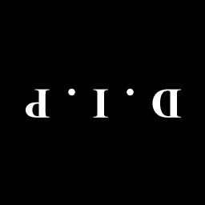
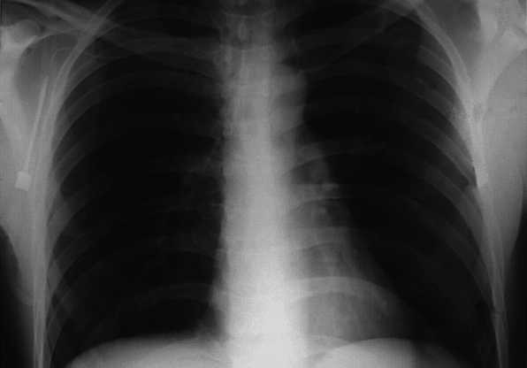
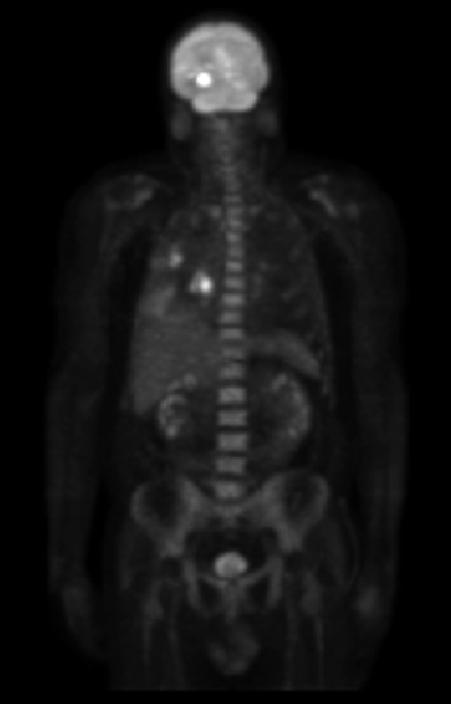
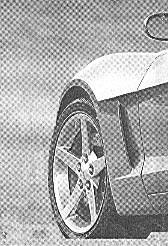

<b>数字图像处理及应用 第3次作业</b>

<b>组号： <u>XX（两位数字）</u>&emsp;小组成员： <u>（列出所有小组成员，成员姓名间用1个空格间隔）</u></b>

<b>Part I Exercises</b>

***

**Ex 4.12** Consider a checkerboard image in which each square is $0.5\times 0.5$ mm. Assuming that the image extends infinitely in both coordinate directions, what is the minimum sampling rate (in samples/mm) required to avoid aliasing?

**Answer:**

***

**Ex 4.21** The need for image padding when filtering in the frequency domain was discussed in Section 4.6.6. We showed in that section that images needed to be padded by appending zeros to the ends of rows and columns in the image (see the following image on the left). Do you think it would make a difference if we centered the image and surrounded it by a border of zeros instead (see image on the right), but without changing the total number of zeros used? Explain.

&nbsp

**Answer:**

***

**Ex 4.26** 

(**a**) Show that the Laplacian of a continuous function $f(t, z)$ of continuous variables $t$ and $z$ satisfies the following Fourier transform pair [see Eq. (3.6-3) for a definition of the Laplacian]:
$$
\triangledown^2f(t,z)\Longleftrightarrow{-4\pi^2(\mu^2+v^2)F(\mu,v)}
$$
(**b**) The preceding closed form expression is valid only for continuous variables. However, it can be the basis for implementing the Laplacian in the discrete frequency domain using the $M\times N$ filter 
$$
H(u,v)=-4\pi^2(u^2+v^2)
$$
for $u=0,1,2,\dots, M-1$ and $v=0,1,2,\dots, N-1$. Explain how you would implement this filter.

(**c**) As you saw in Example 4.20, the Laplacian result in the frequency domain was similar to the result of using a spatial mask with a center coefficient equal to -8. Explain the reason why the frequency domain result was not similar instead to the result of using a spatial mask with a center coefficient of -4. See Section 3.6.2 regarding the Laplacian in the spatial domain.

**Answer:**

***

**Ex 4.28** Based on Eq. (3.6-4), one approach for approximating a discrete derivative in 2-D is based on computing differences of the form $f(x+1,y)+f(x-1,y)-2f(x,y)$ and $f(x,y+1)+f(x,y-1)-2f(x,y)$.
(**a**) Find the equivalent filter, $H(u,v)$, for Eq.(3.6-6) in the frequency domain.
$$
\triangledown^2f(x,y)=f(x+1,y)+f(x-1,y)+f(x,y+1)+f(x,y-1)-4f(x,y) \tag{3.6-6}
$$

(**b**) Show that your result is a highpass filter.

**Answer:**

***

**Ex 4.33** Consider the images shown. The image on the right was obtained by: (a) multiplying the image on the left by $(-1)^{x+y}$ ; (b) computing the DFT; (c) taking the complex conjugate of the transform; (d) computing the inverse DFT; and (e) multiplying the real part of the result by  $(-1)^{x+y}$. Explain (mathematically) why the image on the right appears as it does.

&nbsp

**Answer:**

**Ex 4.37**  Given an image of size $M\times N$ you are asked to perform an experiment that consists of repeatedly lowpass filtering the image using a Gaussian lowpass filter with a given cutoff frequency $D_0$. You may ignore computational round-off errors. Let $c_{min}$ denote the smallest positive number representable in the machine in which the proposed experiment will be conducted.
(**a**) Let $K$ denote the number of applications of the filter. Can you predict (without doing the experiment) what the result (image) will be for a sufficiently large value of $K$? If so, what is that result?
(**b**) Derive an expression for the *minimum* value of $K$ that will guarantee the result that you predicted.

**Answer:**

<b>Part II Programming</b>

***

**1.**  Implement Example 4.19 in page 308.

(*followed by  **Matlab live Scripts**  or **Jupyter Scripts** and running results*)

***

**2.** Implement Example 4.21 in page 311.

(*followed by  **Matlab live Scripts**  or **Jupyter Scripts** and running results*)

***

**3.**  Implement Example 4.22 in Page 315.

(*followed by  **Matlab live Scripts**  or **Jupyter Scripts** and running results*)

***

**4.**  Implement Example 4.23  in Page 318.

(*followed by  **Matlab live Scripts**  or **Jupyter Scripts** and running results*)

