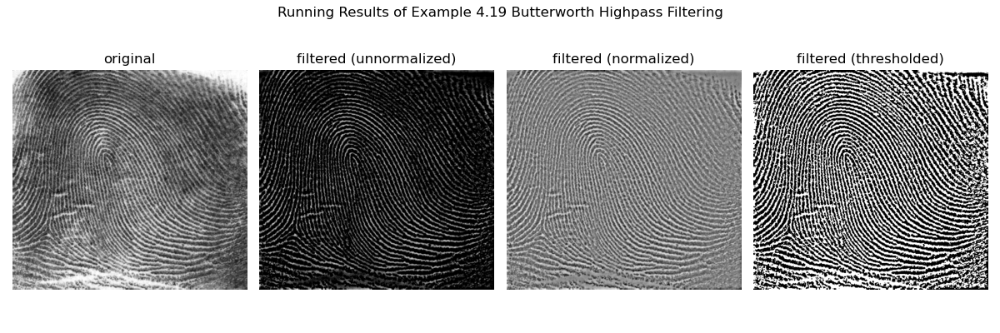
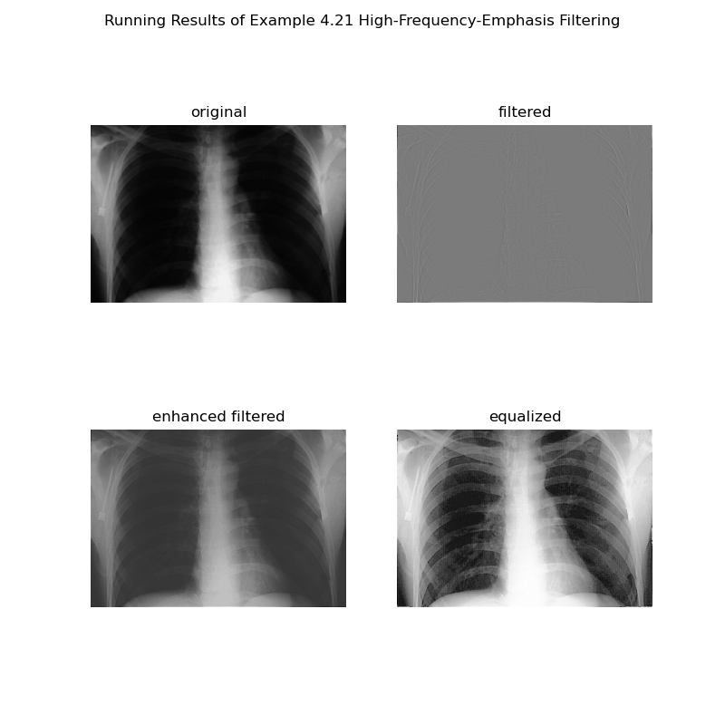
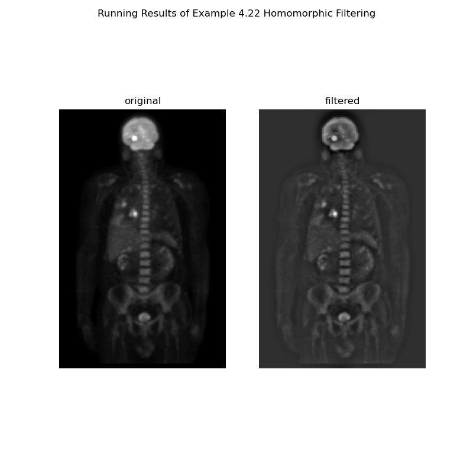
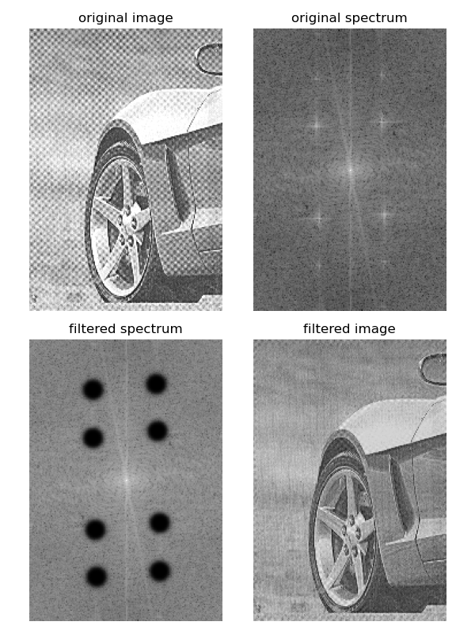

<center><font face="微软雅黑" size=5 color=red><b>数字图像处理及应用 第3次作业</b></font></center>

<center><font face=“微软雅黑" size=4 color = blue><b>组号： <u>16</u>&emsp;小组成员： <u>冯坤龙 郝锦阳 朱从庆 辛梓阳 徐振良</u></b></font></center>


<font face = "微软雅黑" size= 5><b>Part I Exercises</b></font>

***

**Ex 4.12** Consider a checkerboard image in which each square is $0.5\times 0.5$ mm. Assuming that the image extends infinitely in both coordinate directions, what is the minimum sampling rate (in samples/mm) required to avoid aliasing?

**Answer:**

Taking the horizontal direction as an example, we can know that the period of a checkerboard image is equal to $T＝1$ mm by viewing two squares, one black and one white, as a period. According to Nyquist sampling theorem, a period has at least two sampling points. Therefore,to avoid aliasing the minimum sampling rate is $\frac{2}{T}$ (samples/mm)=$2 $(samples/mm).


***

**Ex 4.21** The need for image padding when filtering in the frequency domain was discussed in Section 4.6.6. We showed in that section that images needed to be padded by appending zeros to the ends of rows and columns in the image (see the following image on the left). Do you think it would make a difference if we centered the image and surrounded it by a border of zeros instead (see image on the right), but without changing the total number of zeros used? Explain.

<center class="half">

&nbsp

</center>
**Answer:**

It is known that complementing 0 for an image $f (x,y)$ of size $A×B$ is to prevent errors caused by multiplying $h(x,y)$ of size $C×D$ with $f (x,y)$ of the previous period when convolution is flipped, so it is necessary to complement the image size to $(A+C,B+D)$ to ensure sufficient space for convolution. For this problem, Take a one-dimensional function as an example, let the period of $m(x,y)$ be $M$, the period of $t(x,y)$ be $T$, and the period after taking the complement of $0$ be $M+T$

As shown in the figure, if you fill the end with 0, you can leave $M+T$ space for the convolution


If 0 is filled on both sides, the resulting image is the same as that obtained by filling 0 at the end, leaving a space of size $M+T$ to satisfy the convolution condition


So expanding to two dimensions and using different kinds of padding gives you the same result

***

**Ex 4.26** 

(**a**) Show that the Laplacian of a continuous function $f(t, z)$ of continuous variables $t$ and $z$ satisfies the following Fourier transform pair [see Eq. (3.6-3) for a definition of the Laplacian]:
$$
\triangledown^2f(t,z)\Longleftrightarrow{-4\pi^2(\mu^2+v^2)F(\mu,v)}
$$
(**b**) The preceding closed form expression is valid only for continuous variables. However, it can be the basis for implementing the Laplacian in the discrete frequency domain using the $M\times N$ filter 
$$
H(u,v)=-4\pi^2(u^2+v^2)
$$
for $u=0,1,2,\dots, M-1$ and $v=0,1,2,\dots, N-1$. Explain how you would implement this filter.


(**c**) As you saw in Example 4.20, the Laplacian result in the frequency domain was similar to the result of using a spatial mask with a center coefficient equal to -8. Explain the reason why the frequency domain result was not similar instead to the result of using a spatial mask with a center coefficient of -4. See Section 3.6.2 regarding the Laplacian in the spatial domain.

**Answer:**

(a) We know that the definition of the Laplace operator is
$$
∇^2 f(t,z)=∂^2 f(t,z)/∂t^2 +∂^2 (t,z)/∂z^2
$$
By the property of the Fourier transform
$$
∇^2 f(t,z)\Longleftrightarrow(j2πu)^2 F(u,v)+(j2πv)^2 F(u,v)
$$

$$
=-4π^2 (u^2+v^2 )F(u,v)=H(u,v)F(u,v)
$$

(b) The filter can be taken points and discretized
$$
H_0 (u,v)=-4π^2 (u^2+v^2 )
$$

$$
u=0,1,2…M-1
$$

$$
v=0,1,2…N-1
$$

Then the filter is centralized
$$
H_1 (u,v)=H_0 (u-M/2,v-N/2)
$$

$$
∇^2 f(t,z)\Longleftrightarrow H_1 (u,v)F(u,v)
$$

$$
u=0,1,2…M-1
$$

$$
v=0,1,2…N-1
$$

(c) Because the Laplacian operator in the frequency domain is similar to the spatial template with a center coefficient of -8, it also has a sharpening effect in the diagonal direction, so it is different from the spatial template with a center coefficient of -4

***

**Ex 4.28** Based on Eq. (3.6-4), one approach for approximating a discrete derivative in 2-D is based on computing differences of the form $f(x+1,y)+f(x-1,y)-2f(x,y)$ and $f(x,y+1)+f(x,y-1)-2f(x,y)$.
(**a**) Find the equivalent filter, $H(u,v)$, for Eq.(3.6-6) in the frequency domain.
$$
\triangledown^2f(x,y)=f(x+1,y)+f(x-1,y)+f(x,y+1)+f(x,y-1)-4f(x,y) \tag{3.6-6}
$$

(**b**) Show that your result is a highpass filter.

**Answer:**

(a) Let's assume
$$
t(x,y)=f(x+1,y)+f(x-1,y)+f(x,y+1)+f(x,y-1)-4f(x,y)
$$
By the property of the Fourier transform
$$
\begin{align}
&T(u,v)=F(u,v)(e^{\frac{j2πu}{M}}+e^{\frac{-j2πu}{M}}+e^{\frac{j2πv}{N}}+e^{\frac{-j2πv}{N}}-4)\\

&=F(u,v)H(u,v)
\end{align}
$$
So we can get
$$
H(u,v)=(e^{\frac{j2πu}{M}}+e^{\frac{-j2πu}{M}}+e^{\frac{j2πv}{N}}+e^{\frac{-j2πv}{N}}-4)
$$
It's given by Euler's formula
$$
H(u,v)=2[cos⁡(\frac{2πu}{M})+cos⁡(\frac{2πv}{N})-2]
$$
(b) You can sketch the filter roughly, using the u direction as an example


Therefore, the same conclusion can be obtained in the v direction, and it can be seen that the filter conforms to the high-pass filter


***

**Ex 4.33** Consider the images shown. The image on the right was obtained by: (a) multiplying the image on the left by $(-1)^{x+y}$ ; (b) computing the DFT; (c) taking the complex conjugate of the transform; (d) computing the inverse DFT; and (e) multiplying the real part of the result by  $(-1)^{x+y}$. Explain (mathematically) why the image on the right appears as it does.

<center class="half">

&nbsp

</center>


**Answer:**

Let's assume
$$
h(x,y)=f(x,y)×(-1)^{x+y}
$$
Then there is
$$
h(x,y)\Longleftrightarrow H(u,v)
$$
And because h(x,y) is a real function

$$
h(-x,-y)\Longleftrightarrow H^* (u,v)
$$
​                                                                             (This is given by the symmetry of the DFT)

So we get
$$
h(-x,-y)×(-1)^{x+y}=f(-x,-y)×(-1)^{-(x+y)}×(-1)^{x+y}=f(-x,-y)
$$
Therefore, the phenomenon shown in the figure will occur

**Ex 4.37**  Given an image of size $M\times N$ you are asked to perform an experiment that consists of repeatedly lowpass filtering the image using a Gaussian lowpass filter with a given cutoff frequency $D_0$. You may ignore computational round-off errors. Let $c_{min}$ denote the smallest positive number representable in the machine in which the proposed experiment will be conducted.
(**a**) Let $K$ denote the number of applications of the filter. Can you predict (without doing the experiment) what the result (image) will be for a sufficiently large value of $K$? If so, what is that result?
(**b**) Derive an expression for the *minimum* value of $K$ that will guarantee the result that you predicted.

**Answer:**

$(a)$   By Gaussian filter Expression

​                                                                                               $H(u,v)=e^{-\frac{D^2(u,v)}{2D^2_0}}$,

​         We assume that the original image is 

​                                                                                             $f(x,y)\Longleftrightarrow F(u,v)$ 

​         Filter the image by once, we can get 

​                                                                          $T(u,v)=H(u,v)F(u,v)=e^{-\frac{D^2(u,v)}{2D^2_0}}F(u,v)$

​         Filter the image by K times,we can get 

​                                                                    $G(u,v) =[H(u,v)]^k  F(u,v)=e^{-\frac{KD^2(u,v)}{2D^2_0}}F(u,v)$

​         When K is large enough,   we can only remain the lowest frequency part of the image $F(0,0)$ 

​         and its size is the average size of the entire image.

$(b)$    by result in $(a)$                                                    $[H(u,v)]^k=e^{-\frac{KD^2(u,v)}{2D^2_0}}$ 

​                                                                                            when     $K→∞$
$$
[H(u,v)]^k=
\begin{cases}
1,\ \ \ \ (u,v)=(0,0)\\
0,\ \ \ \ \ else\\
\end{cases}
$$
​         due to $$Cmin$$ is the smallest positive number representable in the machine and u,v are both positive integers

​         so we can get

​                                                                                          $$&e^{-\frac{KD^2(u,v)}{2D^2_0}} < 0.5 Cmin\\$$

 

​                                                                                      $$&⇒K>{\frac{-2D^2_0ln(0.5Cmin)}{D^2(u,v)}}\\$$


​                                                                                $$&⇒K_{min}=[\frac{-2D^2_0ln(0.5Cmin)}{D^2(u,v)}]_{max}\\$$


​                                                                                                 $$&=\frac{-2D^2_0ln(0.5Cmin)}{1}\\$$


​                                                                                                      $$=-2D^2_0ln(0.5Cmin)$$

<font face = "微软雅黑"  size= 5><b>Part II Programming</b></font>

***

**1.**  Implement Example 4.19 in page 308.

<center class="half"></center>


(*followed by  **Matlab live Scripts**  or **Jupyter Scripts** and running results*)


```python
import cv2
import numpy as np
import matplotlib.pyplot as plt


def butterHP(D, n, shape):
    """
    :param D: cutoff frequency
    :param n: order
    :param shape: (rows, columns)
    :return: array H with the same shape
    """
    H = np.zeros(shape, dtype=np.float64)
    row_c, col_c = np.floor(shape[0] / 2), np.floor(shape[1] / 2)
    for u in range(shape[0]):
        for v in range(shape[1]):
            d = np.sqrt(((u - row_c) ** 2) + ((v - col_c) ** 2))
            H[u, v] = 1 / (1 + np.power(D / (0.00000000001 + d), 2 * n))
    return H


# read the original image
original_img = cv2.imread("../images/Fig0457(a)(thumb_print).png", flags=0)

# calculate the 2D DFT of the original image using `np.fft.fft2()`
original_frq = np.fft.fft2(original_img)

# centralize DFT
centred_original_frq = np.fft.fftshift(original_frq)

# construct a Butterworth Highpass Filter
BHPF = butterHP(D=25, n=4, shape=original_img.shape)

# apply the Butterworth Highpass Filter
centred_filtered_frq = centred_original_frq * BHPF

# inverse the 2D DFT
filtered_frq = np.fft.ifftshift(centred_filtered_frq)
filtered_img = np.real(np.fft.ifft2(filtered_frq))
filtered_img_cutoff = filtered_img.copy()
filtered_img_cutoff[filtered_img_cutoff < 0] = 0

# threshold the filtered image setting negative values to 0, positive values to 1
threshold_img = filtered_img.copy()
threshold_img[threshold_img < 0] = 0
threshold_img[threshold_img > 0] = 1

# display the results
plt.figure("Butterworth Highpass Filtering", (12, 4))
plt.subplot(141), plt.imshow(original_img, 'gray'), plt.title("original"), plt.axis('off')
plt.subplot(142), plt.imshow(filtered_img_cutoff, 'gray'), plt.title("filtered (unnormalized)"), plt.axis('off')
plt.subplot(143), plt.imshow(filtered_img, 'gray'), plt.title("filtered (normalized)"), plt.axis('off')
plt.subplot(144), plt.imshow(threshold_img, 'gray'), plt.title("filtered (thresholded)"), plt.axis('off')
plt.suptitle(f"Running Results of Example 4.19 Butterworth Highpass Filtering")

plt.tight_layout()
plt.show()

```



***

**2.** Implement Example 4.21 in page 311.

<center class="half"></center>

(*followed by  **Matlab live Scripts**  or **Jupyter Scripts** and running results*)

```python
import cv2
import numpy
import matplotlib.pyplot as plt

original_image = cv2.imread("../images/Fig0459(a)(orig_chest_xray).png", flags=0)

# FFT and shift
original_frq = numpy.fft.fft2(original_image)
centred_original_frq = numpy.fft.fftshift(original_frq)

# construct a Gaussian Highpass Filter
rows, cols = original_image.shape  # rows cols分别得到图像的行数和列数
row_centre, col_centre = rows // 2, cols // 2  # 得到图像中心点的坐标（crow，cols）
D0 = 70
GHPF = numpy.zeros((rows, cols))
for u in range(rows):
    for v in range(cols):
        D2 = (u - row_centre) ** 2 + (v - col_centre) ** 2
        GHPF[u, v] = 1 - numpy.exp(-D2 / (2 * D0 * D0))

centred_filtered_frq = centred_original_frq * GHPF
filtered_frq = numpy.fft.ifftshift(centred_filtered_frq)
filtered_img = numpy.real(numpy.fft.ifft2(filtered_frq))

# high-frequency-emphasis filtering using the same filter
k1 = 0.5
k2 = 0.75
centred_enhanced_filtered_freq = numpy.zeros((rows, cols), dtype=numpy.complex128)
for u in range(rows):
    for v in range(cols):
        centred_enhanced_filtered_freq[u, v] = (k1 + k2 * GHPF[u, v]) * centred_original_frq[u, v]
enhanced_filtered_frq = numpy.fft.ifftshift(centred_enhanced_filtered_freq)
enhanced_filtered_img = numpy.real(numpy.fft.ifft2(enhanced_filtered_frq))

# performing histogram equalization
equalized_img = cv2.equalizeHist(enhanced_filtered_img.astype(numpy.uint8))

# display the results
plt.figure("High-Frequency-Emphasis Filtering", (8, 8))
plt.subplot(221), plt.imshow(original_image, 'gray'), plt.title("original"), plt.axis('off')
plt.subplot(222), plt.imshow(filtered_img, 'gray'), plt.title("filtered"), plt.axis('off')
plt.subplot(223), plt.imshow(enhanced_filtered_img, 'gray'), plt.title("enhanced filtered"), plt.axis('off')
plt.subplot(224), plt.imshow(equalized_img, 'gray'), plt.title("equalized"), plt.axis('off')
plt.suptitle(f"Running Results of Example 4.21 High-Frequency-Emphasis Filtering")

plt.tight_layout()
plt.show()

```



***

**3.**  Implement Example 4.22 in Page 315.

<center class="half"></center>

(*followed by  **Matlab live Scripts**  or **Jupyter Scripts** and running results*)

```python
import cv2
import numpy as np
import matplotlib.pyplot as plt


def homo_filter(gamma_L, gamma_H, c, D, shape):
    H = np.zeros(shape, dtype=np.float64)
    row_c, col_c = np.floor(shape[0] / 2), np.floor(shape[1] / 2)
    D_sqr = D ** 2
    for u in range(shape[0]):
        for v in range(shape[1]):
            d_sqr = ((u - row_c) ** 2) + ((v - col_c) ** 2)
            H[u, v] = ((gamma_H - gamma_L) * (1 - np.exp(-c * d_sqr / D_sqr))) + gamma_L
    return H


# define constants
GAMMA_L = 0.4
GAMMA_H = 3.0
SLOPE = 5
CUTOFF_FREQUENCY = 20

# read the original image
original_img = cv2.imread("../images/Fig0462(a)(PET_image).png", flags=0)

# calculate the 2D DFT of the original image using `np.fft.fft2()`
original_frq = np.fft.fft2(original_img)

# centralize DFT
centred_original_frq = np.fft.fftshift(original_frq)

# construct a Homomorphic Filter
HF = homo_filter(GAMMA_L, GAMMA_H, c=SLOPE, D=CUTOFF_FREQUENCY, shape=original_img.shape)

# apply the Homomorphic Filter
centred_filtered_frq = centred_original_frq * HF

# inverse the 2D DFT
filtered_frq = np.fft.ifftshift(centred_filtered_frq)
filtered_img = np.real(np.fft.ifft2(filtered_frq))

# display the results
plt.figure("Homomorphic Filtering", (8, 8))
plt.subplot(121), plt.imshow(original_img, 'gray'), plt.title("original"), plt.axis('off')
plt.subplot(122), plt.imshow(filtered_img, 'gray'), plt.title("filtered"), plt.axis('off')
plt.suptitle(f"Running Results of Example 4.22 Homomorphic Filtering")

plt.tight_layout()
plt.show()

```



***

**4.**  Implement Example 4.23  in Page 318.

<center class="half"></center>

(*followed by  **Matlab live Scripts**  or **Jupyter Scripts** and running results*)

```python
import cv2
import numpy as np
import matplotlib.pyplot as plt


def butter_notch_reject(Q, u_list, v_list, D_list, n, shape):
    M, N = shape
    row_c, col_c = np.floor(M / 2), np.floor(N / 2)
    H_NR = np.ones(shape, dtype=np.float64)
    for k in range(Q):
        H = np.zeros(shape, dtype=np.float64)
        H_1 = np.zeros(shape, dtype=np.float64)
        H_2 = np.zeros(shape, dtype=np.float64)
        for u in range(M):
            for v in range(N):
                d_1 = np.sqrt((u - row_c - u_list[k]) ** 2 + (v - col_c - v_list[k]) ** 2)
                d_2 = np.sqrt((u - row_c + u_list[k]) ** 2 + (v - col_c + v_list[k]) ** 2)
                H_1[u, v] = 1 / (1 + np.power(D_list[k] / (0.00000000001 + d_1), 2 * n))
                H_2[u, v] = 1 / (1 + np.power(D_list[k] / (0.00000000001 + d_2), 2 * n))
        H = H_1 * H_2
        H_NR *= H
    return H_NR


# read the original image
original_img = cv2.imread("../images/Fig0464(a)(car_75DPI_Moire).png", flags=0)

# calculate the 2D DFT of the original image
original_frq = np.fft.fft2(original_img)
centred_original_frq = np.fft.fftshift(original_frq)

original_spectrum = np.abs(centred_original_frq)
log_spectrum = np.log(original_spectrum)

xs = [55, 55, 57, 58]
ys = [44, 86, 166, 207]
u = []
v = []
row_c, col_c = np.floor(original_img.shape[0] / 2), np.floor(original_img.shape[1] / 2)
for x in xs:
    v.append(col_c - x)
for y in ys:
    u.append(row_c - y)

D = [9 for i in range(4)]
BNRF = butter_notch_reject(4, u, v, D, n=4, shape=original_img.shape)
centred_filtered_frq = centred_original_frq * BNRF
filtered_spectrum = log_spectrum * BNRF
log_filtered_spectrum = np.log(filtered_spectrum)

# inverse the 2D DFT
filtered_frq = np.fft.ifftshift(centred_filtered_frq)
filtered_img = np.real(np.fft.ifft2(filtered_frq))

# display the results
plt.figure("Notch Reject Filtering", (6, 8))
plt.subplot(221), plt.imshow(original_img, 'gray'), plt.title("original image"), plt.axis('off')
plt.subplot(222), plt.imshow(log_spectrum, 'gray'), plt.title("original spectrum"), plt.axis('off')
plt.subplot(223), plt.imshow(filtered_spectrum, 'gray'), plt.title("filtered spectrum"), plt.axis('off')
plt.subplot(224), plt.imshow(filtered_img, 'gray'), plt.title("filtered image"), plt.axis('off')

plt.tight_layout()
plt.show()

```


