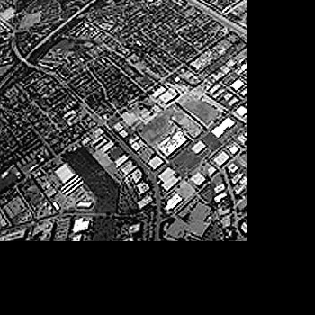
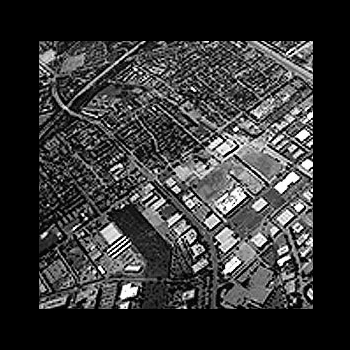
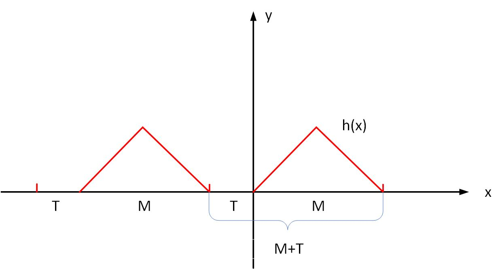
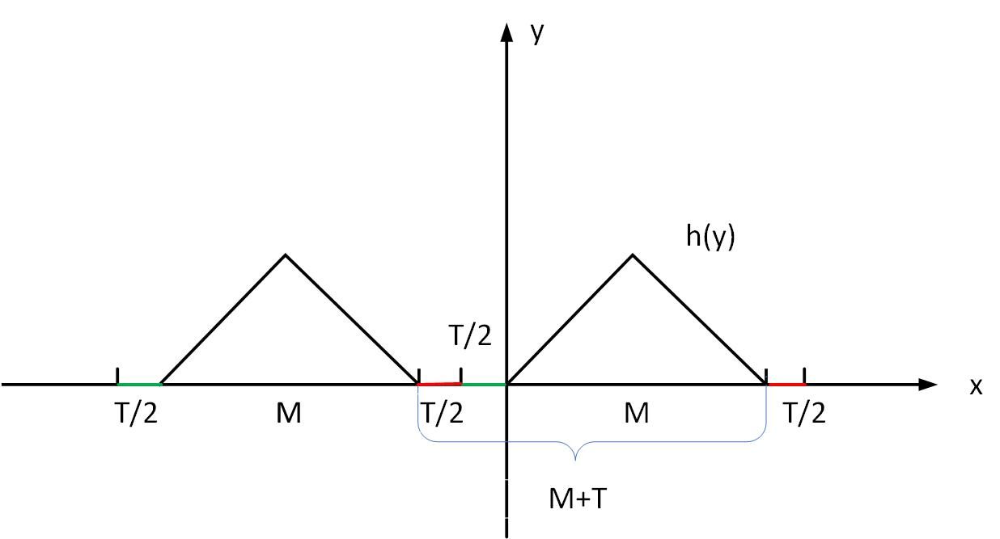
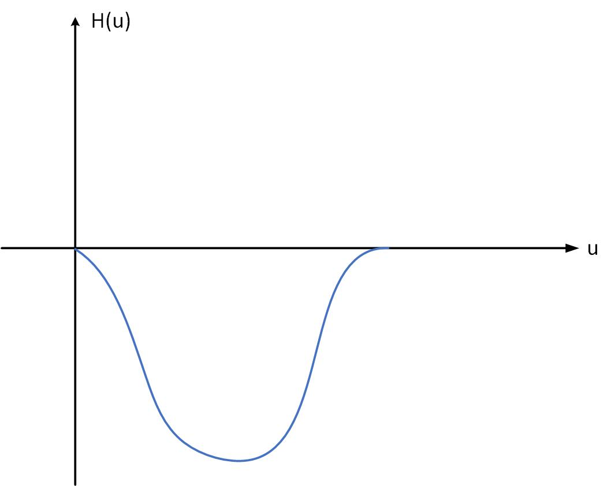
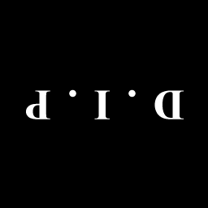
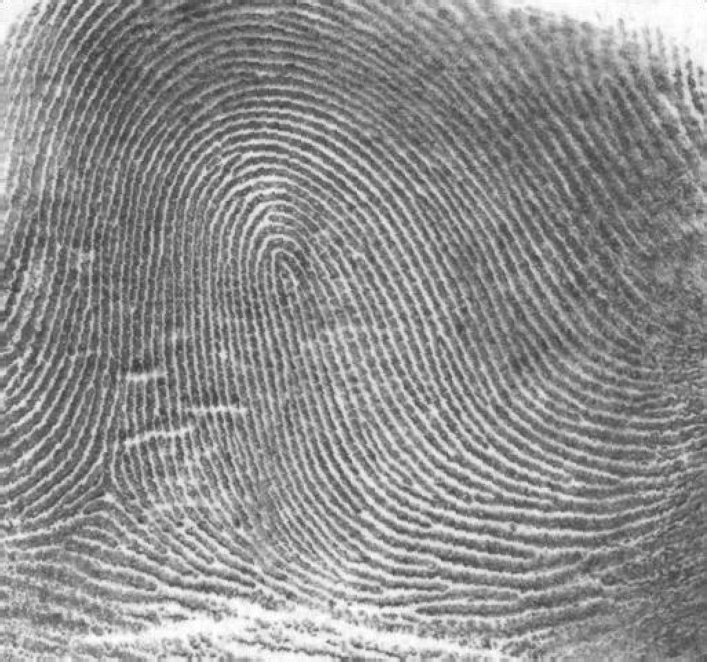
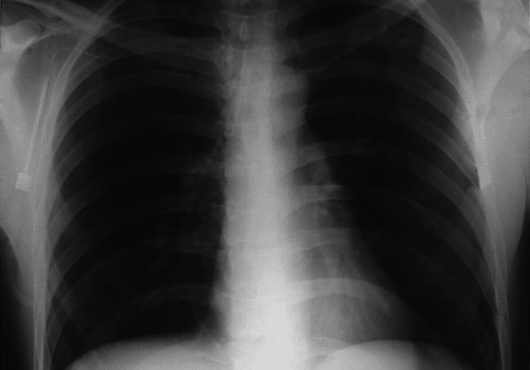
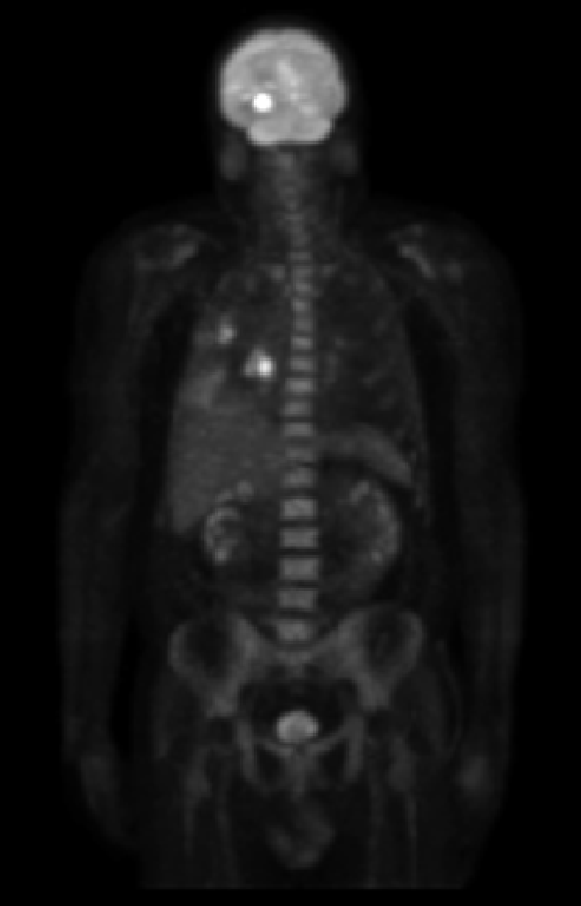
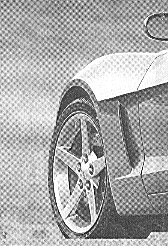

<b>数字图像处理及应用 第3次作业</b>

<b>组号： <u>16</u>&emsp;小组成员： <u>冯坤龙 郝锦阳 朱从庆 辛梓阳 徐振良</u></b>

<b>Part I Exercises</b>

***

**Ex 4.12** Consider a checkerboard image in which each square is $0.5\times 0.5$ mm. Assuming that the image extends infinitely in both coordinate directions, what is the minimum sampling rate (in samples/mm) required to avoid aliasing?

**Answer:**

Taking the horizontal direction as an example, we can know that the period of a checkerboard image is equal to $T＝1$ mm by viewing two squares, one black and one white, as a period. According to Nyquist sampling theorem, a period has at least two sampling points. Therefore,to avoid aliasing the minimum sampling rate is $\frac{2}{T}$ (samples/mm)=$2 $(samples/mm).

***

**Ex 4.21** The need for image padding when filtering in the frequency domain was discussed in Section 4.6.6. We showed in that section that images needed to be padded by appending zeros to the ends of rows and columns in the image (see the following image on the left). Do you think it would make a difference if we centered the image and surrounded it by a border of zeros instead (see image on the right), but without changing the total number of zeros used? Explain.

&nbsp

**Answer:**

It is known that complementing 0 for an image $f (x,y)$ of size $A×B$ is to prevent errors caused by multiplying $h(x,y)$ of size $C×D$ with $f (x,y)$ of the previous period when convolution is flipped, so it is necessary to complement the image size to $(A+C,B+D)$ to ensure sufficient space for convolution. For this problem, Take a one-dimensional function as an example, let the period of $m(x,y)$ be $M$, the period of $t(x,y)$ be $T$, and the period after taking the complement of $0$ be $M+T$

As shown in the figure, if you fill the end with 0, you can leave $M+T$ space for the convolution

If 0 is filled on both sides, the resulting image is the same as that obtained by filling 0 at the end, leaving a space of size $M+T$ to satisfy the convolution condition

So expanding to two dimensions and using different kinds of padding gives you the same result

***

**Ex 4.26** 

(**a**) Show that the Laplacian of a continuous function $f(t, z)$ of continuous variables $t$ and $z$ satisfies the following Fourier transform pair [see Eq. (3.6-3) for a definition of the Laplacian]:
$$
\triangledown^2f(t,z)\Longleftrightarrow{-4\pi^2(\mu^2+v^2)F(\mu,v)}
$$
(**b**) The preceding closed form expression is valid only for continuous variables. However, it can be the basis for implementing the Laplacian in the discrete frequency domain using the $M\times N$ filter 
$$
H(u,v)=-4\pi^2(u^2+v^2)
$$
for $u=0,1,2,\dots, M-1$ and $v=0,1,2,\dots, N-1$. Explain how you would implement this filter.

(**c**) As you saw in Example 4.20, the Laplacian result in the frequency domain was similar to the result of using a spatial mask with a center coefficient equal to -8. Explain the reason why the frequency domain result was not similar instead to the result of using a spatial mask with a center coefficient of -4. See Section 3.6.2 regarding the Laplacian in the spatial domain.

**Answer:**

(a) We know that the definition of the Laplace operator is
$$
∇^2 f(t,z)=∂^2 f(t,z)/∂t^2 +∂^2 (t,z)/∂z^2
$$
By the property of the Fourier transform
$$
∇^2 f(t,z)\Longleftrightarrow(j2πu)^2 F(u,v)+(j2πv)^2 F(u,v)
$$

$$
=-4π^2 (u^2+v^2 )F(u,v)=H(u,v)F(u,v)
$$

(b) The filter can be taken points and discretized
$$
H_0 (u,v)=-4π^2 (u^2+v^2 )
$$

$$
u=0,1,2…M-1
$$

$$
v=0,1,2…N-1
$$

Then the filter is centralized
$$
H_1 (u,v)=H_0 (u-M/2,v-N/2)
$$

$$
∇^2 f(t,z)=H_1 (u,v)∙F(u,v)
$$

$$
u=0,1,2…M-1
$$

$$
v=0,1,2…N-1
$$

(c) Because the Laplacian operator in the frequency domain is similar to the spatial template with a center coefficient of -8, it also has a sharpening effect in the diagonal direction, so it is different from the spatial template with a center coefficient of -4

***

**Ex 4.28** Based on Eq. (3.6-4), one approach for approximating a discrete derivative in 2-D is based on computing differences of the form $f(x+1,y)+f(x-1,y)-2f(x,y)$ and $f(x,y+1)+f(x,y-1)-2f(x,y)$.
(**a**) Find the equivalent filter, $H(u,v)$, for Eq.(3.6-6) in the frequency domain.
$$
\triangledown^2f(x,y)=f(x+1,y)+f(x-1,y)+f(x,y+1)+f(x,y-1)-4f(x,y) \tag{3.6-6}
$$

(**b**) Show that your result is a highpass filter.

**Answer:**

(a) Let's assume
$$
t(x,y)=f(x+1,y)+f(x-1,y)+f(x,y-1)+f(x,y+1)-φf(x,y)
$$
It's given by the Fourier transfor
$$
\begin{align}
&T(u,v)=F(u,v)(e^{\frac{j2πu}{M}}+e^{\frac{-j2πu}{M}}+e^{\frac{j2πv}{N}}+e^{\frac{-j2πv}{N}}-φ)\\
&=F(u,v)·H(u,v)
\end{align}
$$
So we can get
$$
H(u,v)=(e^{\frac{j2πu}{M}}+e^{\frac{-j2πu}{M}}+e^{\frac{j2πv}{N}}+e^{\frac{-j2πv}{N}}-φ)
$$
It's given by Euler's formula
$$
2[cos⁡(\frac{2πu}{M})+cos⁡(\frac{2πv}{N})-2]
$$
(b) You can sketch the filter roughly, using the u direction as an example

Therefore, the same conclusion can be obtained in the v direction, and it can be seen that the filter conforms to the high-pass filter

***

**Ex 4.33** Consider the images shown. The image on the right was obtained by: (a) multiplying the image on the left by $(-1)^{x+y}$ ; (b) computing the DFT; (c) taking the complex conjugate of the transform; (d) computing the inverse DFT; and (e) multiplying the real part of the result by  $(-1)^{x+y}$. Explain (mathematically) why the image on the right appears as it does.

&nbsp

**Answer:**

Let's assume
$$
h(x,y)=f(x,y)×(-1)^{x+y}
$$
Then there is
$$
h(x,y)\Longleftrightarrow H(u,v)
$$
And because h(x,y) is a real function(This is given by the symmetry of the DFT)
$$
h(-x,-y)\Longleftrightarrow H^* (u,v)
$$
So we get
$$
h(-x,-y)×(-1)^{x+y}=f(-x,-y)·(-1)^{-(x+y)}·(-1)^{x+y}=f(-x,-y)
$$
Therefore, the phenomenon shown in the figure will occur

**Ex 4.37**  Given an image of size $M\times N$ you are asked to perform an experiment that consists of repeatedly lowpass filtering the image using a Gaussian lowpass filter with a given cutoff frequency $D_0$. You may ignore computational round-off errors. Let $c_{min}$ denote the smallest positive number representable in the machine in which the proposed experiment will be conducted.
(**a**) Let $K$ denote the number of applications of the filter. Can you predict (without doing the experiment) what the result (image) will be for a sufficiently large value of $K$? If so, what is that result?
(**b**) Derive an expression for the *minimum* value of $K$ that will guarantee the result that you predicted.

**Answer:**

$(a)$ By Gaussian filter Expression: $H(u,v)=e^{-\frac{D^2(u,v)}{2D^2_0}}$,

We assume that the original image is : $f(u,v)$, 

The result of Fourier transform on $f(u,v)$ is : $F(u,v)$,

Filter the image by once, we can get $T(x,y)=H(u,v)·F(u,v)=e^{-\frac{D^2(u,v)}{2D^2_0}}·F(u,v)$

Filter the image by K times,we can get $G(x,y) =[H(u,v)]^k·F(u,v)=e^{-\frac{KD^2(u,v)}{2D^2_0}}·F(u,v)$

Predict: $K$ in enough, when $K→∞$,  so we can only remain $F(0,0)$ by Gaussian Filter Expression,

and its size is the average size of the entire image.

$(b)$ by prediction in $(a)$, $K→∞$, $G(x,y) =[H(u,v)]^k·F(u,v)=e^{-\frac{KD^2(u,v)}{2D^2_0}}·F(u,v)$ 
$$
G(u,v)=
\begin{cases}
1,\ \ \ \ (u,v)=(0,0)\\
0,\ \ \ \ \ else\\
\end{cases}
$$
due to Cmin is the smallest pozition number representable in the machine,

When $e^{-\frac{KD^2(u,v)}{2D^2_0}} < 0.5 Cmin$ ,we can get $G(u,v)= 0$ 
$$
\begin{align}
&e^{-\frac{KD^2(u,v)}{2D^2_0}} < 0.5 Cmin\\
&⇒K>{\frac{-2D^2_0ln(0.5Cmin)}{D^(u,v)}}\\
&⇒K_{min}=[\frac{-2D^2_0ln(0.5Cmin)}{D^(u,v)}]_{min}\\
&=\frac{-2D^2_0ln(0.5Cmin)}{1}\\
&=-2D^2_0ln(0.5Cmin)
\end{align}
$$

<b>Part II Programming</b>

***

**1.**  Implement Example 4.19 in page 308.

(*followed by  **Matlab live Scripts**  or **Jupyter Scripts** and running results*)

***

**2.** Implement Example 4.21 in page 311.

(*followed by  **Matlab live Scripts**  or **Jupyter Scripts** and running results*)

***

**3.**  Implement Example 4.22 in Page 315.

(*followed by  **Matlab live Scripts**  or **Jupyter Scripts** and running results*)

***

**4.**  Implement Example 4.23  in Page 318.

(*followed by  **Matlab live Scripts**  or **Jupyter Scripts** and running results*)

