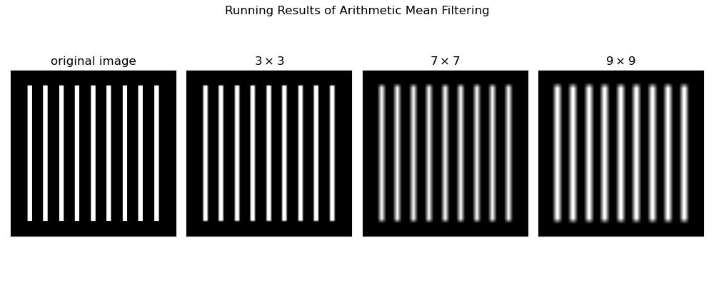
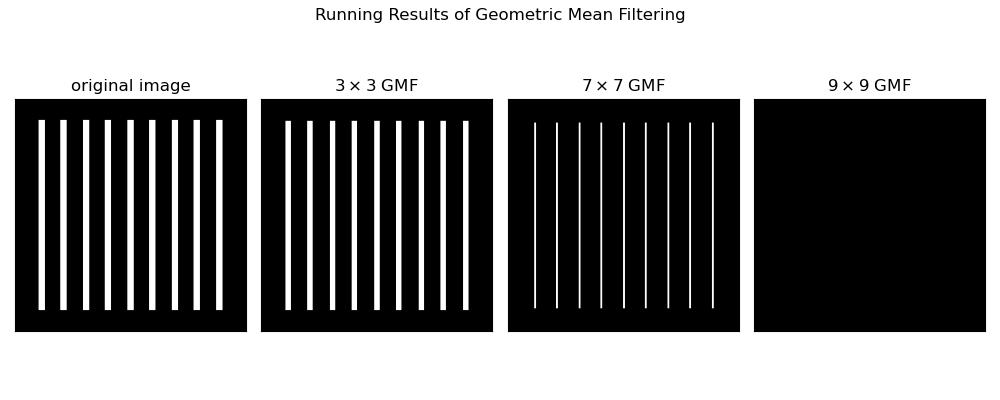
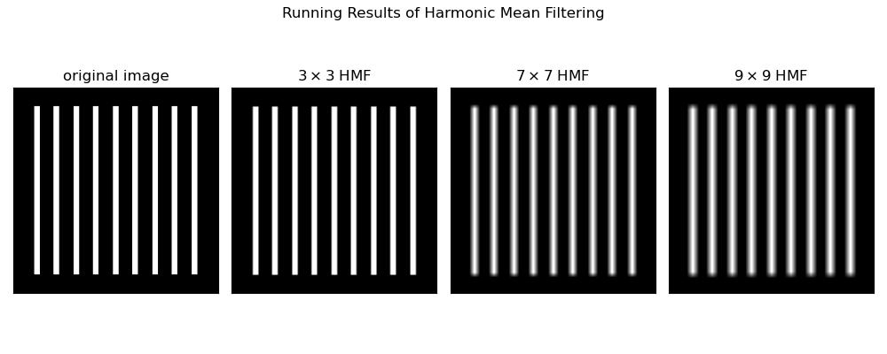
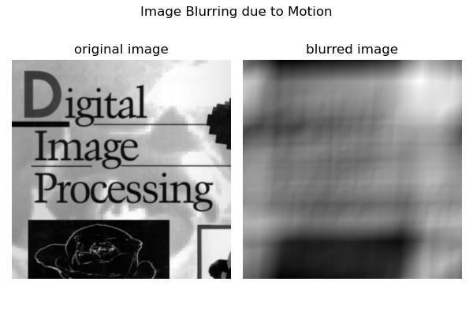
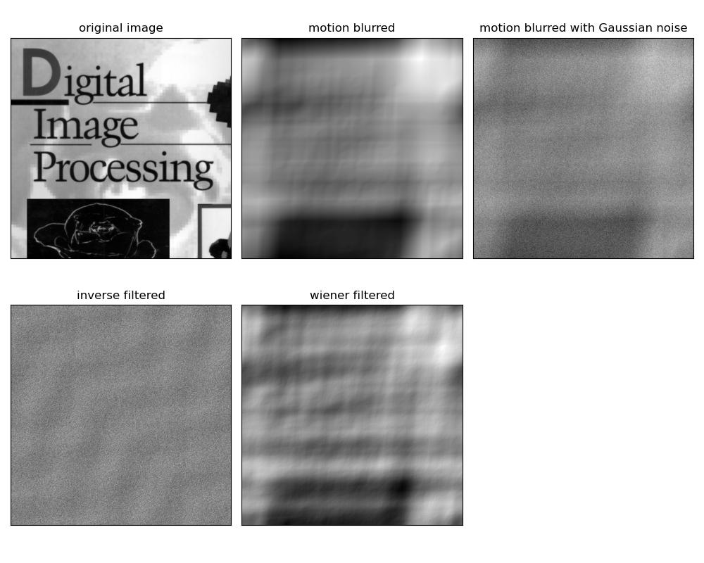

<center><font face="微软雅黑" size=5 color=red><b>数字图像处理及应用 第4次作业</b></font></center>

<center><font face=“微软雅黑" size=4 color = blue><b>组号： <u>16</u>&emsp;小组成员： <u>冯坤龙 郝锦阳 朱从庆 辛梓阳 徐振良</u></b></font></center>


<font face = "微软雅黑" size= 5><b>Part I Exercises</b></font>

***

**Ex.1** The image shown in FIGURE 1 consists of two infinitesimally thin white lines on a black background, intersecting at some point in the image. The image is input into a linear, position invariant system with the impulse response given as Eq.1.
$$
h(x,y)=e^{-[(x-\alpha)^2+(y-\beta)^2]} \tag{1}
$$
Assuming continuous variables and negligible noise, find an expression for the output image $g(x,y)$. 

<div align=center></div>

<div align=center><b>FIGURE 1</b></div>

**Answer:**


***

**Ex.2** During acquisition, an image undergoes uniform linear motion in the vertical direction for a time $T_1$. The direction of motion then switches to the horizontal direction for a time interval $T_2$. Assuming that the time it takes the image to change directions is negligible, and that shutter opening and closing times are negligible also, give an expression for the blurring function, $H(u,v)$.

**Answer:**


***

**Ex.3** 

(**a**) The image in (b) and (c) were obtained by inverse and Wiener-filtering the image in (a), which is a motion blurred image that, in addition, is corrupted by additive Gaussian noise. The blurring itself is corrected in (b) and (c). However, the restored image (b) has a strong streak pattern that is not apparent in (a) [for example, compare the area of constant white in the top right of (b) with the corresponding are in (a).] On the other hand, the streak pattern does not appear in (c). Explain how this pattern originated and why Wiener filter can avoid it.

<table frame=void rules=none>
<tr>
    <td style="border:none;"><div align=center></div></td>
    <td style="border:none;"><div align=center></div></td>
    <td style="border:none; border-collapse:collapse;"><div align=center></div></td>
</tr>
<tr>
    <td style="border: none;"><div align=center>(<b>a</b>)</div></td>
    <td style="border: none;"><div align=center>(<b>b</b>)</div></td>
    <td style="border: none;"><div align=center>(<b>c</b>)</div></td>  
</tr>
</table>

<div align=center><b>FIGURE 2 Inverse and Wiener filtering</b></div>

**Answer:**


***

**Ex.4** A certain X-ray imaging geometry produces a blurring degradation that can be modeled as the convolution of the sensed image with the spatial, circularly symmetric function
$$
h(x,y)=\frac{x^2+y^2-2\sigma^2}{\sigma^4}e^{-\frac{x^2+y^2}{2\sigma^2}} \tag{2}
$$
Assuming continuous variables, show that the degradation in the frequency domain is given by the expression
$$
H(u,v)=-8\pi^3\sigma^2(u^2+v^2)e^{-2\pi^2\sigma^2(u^2+v^2)} \tag{3}
$$
**Answer:**


***

**Ex.5** The image shown is a blurred, 2-D projection of a volumetric rendition of a heart. It is known that each of the cross hairs on the right bottom part of the image was 4 pixels wide, 20 pixels long, and had an intensity value of 255 before blurring. Provide a step-by-step procedure indicating how you would use the information just given to obtain the blurring function $H(u,v)$.

<div align=center></div>

<div align=center><b>FIGURE 3 Volumetric rendition of a heart</b></div>


**Answer:**


***

**Ex.6** Explain the reason for the formation of image (d) in FIGURE 4 (refer to Example 4.6 in page 252)，which is acquired by an imaging system with maximum sampling rate of $96\times 96$. The original image of (d) is a checkerboard like image, which each of its square is of $0.4798\times 0.4798$ pixels.

<div align=center></div>


<div align=center><b>FIGURE 4 Aliasing in image</b></div>


<div STYLE="page-break-after: always;"></div>

<font face = "微软雅黑"  size= 5><b>Part II Programming</b></font>

***

**1.** The arithmetic mean filter is defined as
$$
\hat{f}(x,y)=\frac{1}{mn}\sum\limits_{(s,t)\in S_{xy}}g(s,t).
$$
The white bars in the test pattern shown are 7 pixels wide and 210 pixels high. The separation between bars is 17 pixels. What would this image look like after application of

(**a**) A $3\times 3$ arithmetic mean filter?
(**b**) A $7\times 7$ arithmetic mean filter?
(**c**) A $9\times 9$ arithmetic mean filter? 

<div align=center></div>

<div align=center><b>FIGURE 5 Test pattern</b></div>

(*followed by  **Matlab live Scripts**  or **Jupyter Scripts** and running results*)

```python
import cv2
import matplotlib.pyplot as plt

# open
original_image = cv2.imread("../images/FigP0501.png", flags=0)
size1 = (3, 3)
size2 = (7, 7)
size3 = (9, 9)
size = [3, 7, 9]

target_image = []
target_image.append(cv2.blur(original_image, size1))
target_image.append(cv2.blur(original_image, size2))
target_image.append(cv2.blur(original_image, size3))

# show
fig, axs = plt.subplots(nrows=1, ncols=4, figsize=(10, 4))

ax = axs[0]
ax.imshow(original_image, cmap='gray')
ax.set_title(f"original image")
ax.set_xticks([])
ax.set_yticks([])

for i in range(3):
    ax = axs[i + 1]
    ax.imshow(target_image[i], cmap='gray')
    ax.set_title(fr"${size[i]}\times${size[i]}")
    ax.set_xticks([])
    ax.set_yticks([])

plt.suptitle("Running Results of Arithmetic Mean Filtering")

plt.tight_layout()

# output = f'../images/Arithmetic Mean Filtering.jpg'
# plt.savefig(output)

plt.show()

```



**2.**   Repeat **1** using a geometric mean filter which is defined as 
$$
\hat{f}(x,y)=\left[\prod_{(s,t)\in{S_{xy}}}g(s,t)\right]^\frac{1}{mn}.
$$
(*followed by **Matlab live Scripts** or **Jupyter Scripts** and running results*)

```python
import cv2
import numpy as np
import matplotlib.pyplot as plt


def geometric_mean_filter(img, ksize):
    h, w = img.shape[:2]
    expo = 1 / (ksize * ksize)
    pad = int((ksize - 1) / 2)
    # pad the image using `cv2.copyMakeBorder()` whose effect can also be produced by`np.pad()`
    padded = cv2.copyMakeBorder(img, pad, pad, pad, pad, borderType=cv2.BORDER_REFLECT_101)
    filtered = np.zeros(img.shape)
    for i in range(pad, pad + h):
        for j in range(pad, pad + w):
            prod = np.prod(padded[i - pad:i + pad, j - pad:j + pad])
            filtered[i - pad][j - pad] = np.power(prod, expo)
    return filtered


def GMF(img, ksize):
    return geometric_mean_filter(img, ksize)


kernel_size = [3, 7, 9]

# read the original image
original_image = cv2.imread("../images/FigP0501.png", flags=0)

filtered_img = []

# apply filters with different kernel sizes respectively
for ksize in kernel_size:
    filtered_img.append(GMF(original_image, ksize))

# display the results
fig, axs = plt.subplots(nrows=1, ncols=4, figsize=(10, 4))
ax = axs[0]
ax.imshow(original_image, cmap='gray'), ax.set_title(f"original image"), ax.set_xticks([]), ax.set_yticks([])
for i in range(3):
    ax = axs[i + 1]
    ax.imshow(filtered_img[i], 'gray')
    ax.set_title(fr"${kernel_size[i]}\times${kernel_size[i]} GMF")
    ax.set_xticks([]), ax.set_yticks([])

plt.suptitle("Running Results of Geometric Mean Filtering")

plt.tight_layout()

# output = f'../images/Geometric Mean Filtering.jpg'
# plt.savefig(output)

plt.show()

```



**3.**   Repeat **1** using a harmonic mean filter which is defined as 
$$
\hat{f}(x,y)=\frac{mn}{\sum\limits_{(s,t)\in{S_{xy}}}\frac{1}{g(s,t)}}.
$$

(*followed by **Matlab live Scripts** or **Jupyter Scripts** and running results*)

```python
import cv2
import matplotlib.pyplot as plt
import numpy as np


def harmonic_mean_filter(img, ksize):
    h, w = img.shape[:2]
    order = ksize * ksize
    pad = int((ksize - 1) / 2)
    # pad the image using `np.pad()` whose effect can also be produced by`cv2.copyMakeBorder()`
    padded = np.pad(img, pad, 'symmetric')
    filtered = np.zeros(img.shape)
    for i in range(pad, pad + h):
        for j in range(pad, pad + w):
            s = np.sum(1 / (1e10 + padded[i - pad:i + pad, j - pad:j + pad]))
            filtered[i - pad][j - pad] = order / s
    return filtered


# read the original image
original_image = cv2.imread("../images/FigP0501.png", flags=0)
ksize = [3, 7, 9]

filtered_image = []
for size in ksize:
    filtered_image.append(harmonic_mean_filter(original_image, size))

# display the results
fig, axs = plt.subplots(nrows=1, ncols=4, figsize=(10, 4))

ax = axs[0]
ax.imshow(original_image, cmap='gray')
ax.set_title(f"original image")
ax.set_xticks([])
ax.set_yticks([])

for i in range(3):
    ax = axs[i + 1]
    ax.imshow(filtered_image[i], cmap='gray')
    ax.set_title(fr"${ksize[i]}\times${ksize[i]} HMF")
    ax.set_xticks([])
    ax.set_yticks([])

plt.suptitle("Running Results of Harmonic Mean Filtering")

plt.tight_layout()

# output = f'../images/Harmonic Mean Filtering.jpg'
# plt.savefig(output)

plt.show()

```



**4.**  Sketch what the image in FIGURE 6 would look like if it were blurred using the transfer function
$$
H(u,v)=\frac{T}{\pi(ua+vb)}sin[\pi(ua+vb)]e^{-j\pi(ua+vb)}
$$
(**a**) With $a=b=0.1$, and $T=1$.

(**b**) In addition, add Gaussian noise into the resulting image of (a), with zero mean and variance of 650.

<center class="half"></center>

<div align=center><b>FIGURE 6</b></div>

Try to restore the degraded image after procedure (b) using inverse filter, Wiener filter, and constrained least squares filter.

(*followed by  **Matlab live Scripts**  or **Jupyter Scripts** and running results*)

(**a**)

```python
import cv2
import numpy as np
import matplotlib.pyplot as plt


def motion_blur(img, a=0.1, b=0.1, T=1):
    M, N = img.shape[:2]
    H = np.empty(img.shape, dtype=complex)
    # calculate the transfer function of motion blur
    for u in range(M):
        for v in range(N):
            s = u * a + v * b
            H[u, v] = (T / (np.pi * s + np.finfo(float).eps)) * np.sin(np.pi * s) * np.exp(-1j * np.pi * s)

    # apply the transfer function of motion blur
    f = img
    F = np.fft.fft2(f)
    G = H * F
    g = np.fft.ifft2(G)
    g = np.real(g)
    return g


original_img = cv2.imread("../images/Fig0526(a).png", 0)

blurred_img = motion_blur(original_img)

plt.figure(figsize=(6, 4))
plt.subplot(121), plt.imshow(original_img, 'gray'), plt.title("original image"), plt.axis('off')
plt.subplot(122), plt.imshow(blurred_img, 'gray'), plt.title("blurred image"), plt.axis('off')
plt.suptitle("Image Blurring due to Motion")
plt.tight_layout()

# output = f'../images/Image Blurring due to Motion.jpg'
# plt.savefig(output)

plt.show()

```



(**b**)

```python
import cv2
import numpy as np
import matplotlib.pyplot as plt


def motion_degrade_function(img, a=0.1, b=0.1, T=1):
    M, N = img.shape[:2]
    H = np.empty(img.shape, dtype=complex)
    # calculate the transfer function of motion blur
    for u in range(M):
        for v in range(N):
            s = u * a + v * b
            H[u, v] = (T / (np.pi * s + np.finfo(complex).eps)) * np.sin(np.pi * s) * np.exp(-1j * np.pi * s)
    return H


def motion_blur(img, a=0.1, b=0.1, T=1):
    H = motion_degrade_function(img, a, b, T)
    # apply the transfer function of motion blur
    f = img.copy()
    F = np.fft.fft2(f)
    G = H * F
    g = np.fft.ifft2(G)
    g = np.real(g)
    return g


def inverse_motion_blur(img, a=0.1, b=0.1, T=1):
    H = motion_degrade_function(img, a, b, T)
    # apply the transfer function of motion blur
    g = img.copy()
    G = np.fft.fft2(g)
    F = G / (H + np.finfo(complex).eps)
    f = np.fft.ifft2(F)
    f = np.real(f)
    return f


def gauss_blur(img, mean, stand_deviation):
    n = np.random.normal(mean, stand_deviation, img.shape)
    f = img.copy()
    g = f + n
    return g


def wiener_filter(img, H, K):
    G = np.fft.fft2(img)
    H_square = np.power(H, 2)
    H_abs = np.abs(H)
    F = ((1 / (H_abs + np.finfo(complex).eps)) * (H_square / (H_square + K))) * G
    f = np.real(np.fft.ifft2(F))
    return f


original_img = cv2.imread("../images/Fig0526(a).png", 0)
trans_func = motion_degrade_function(original_img)
motion_blurred_img = motion_blur(original_img)

gauss_blurred_img = gauss_blur(motion_blurred_img, 0, np.sqrt(650))

inverse_filtered_img = inverse_motion_blur(gauss_blurred_img)
wiener_filtered_img = wiener_filter(gauss_blurred_img, trans_func, K=0.1)
CLS_filtered_img = 0

# display the results
img_ls = [original_img, motion_blurred_img, gauss_blurred_img, inverse_filtered_img, wiener_filtered_img,
          CLS_filtered_img]
title_ls = ['original image', 'motion blurred', 'motion blurred with Gaussian noise', 'inverse filtered',
            'wiener filtered', 'constrained least squares filtered']
fig, axs = plt.subplots(2, 3, figsize=(10, 8))
for i in range(5):
    ax = axs.flat[i]
    ax.imshow(img_ls[i], cmap='gray')
    ax.set_title(title_ls[i])
    ax.set_xticks([])
    ax.set_yticks([])
axs[1, 2].set_visible(False)
plt.tight_layout()

# output = f'../images/blur&noise.jpg'
# plt.savefig(output)

plt.show()

```


