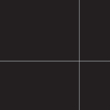
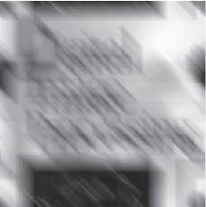
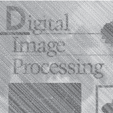
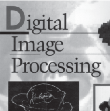
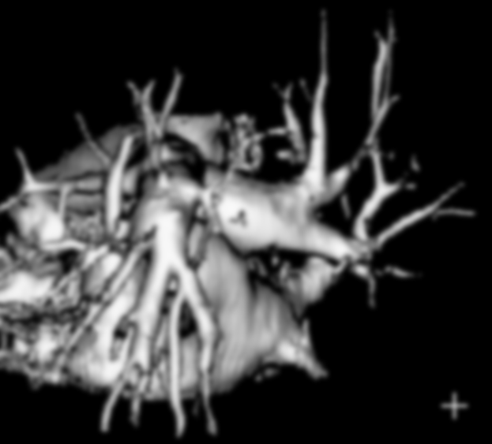
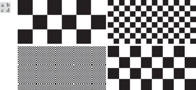
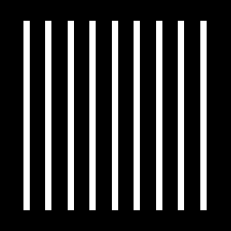
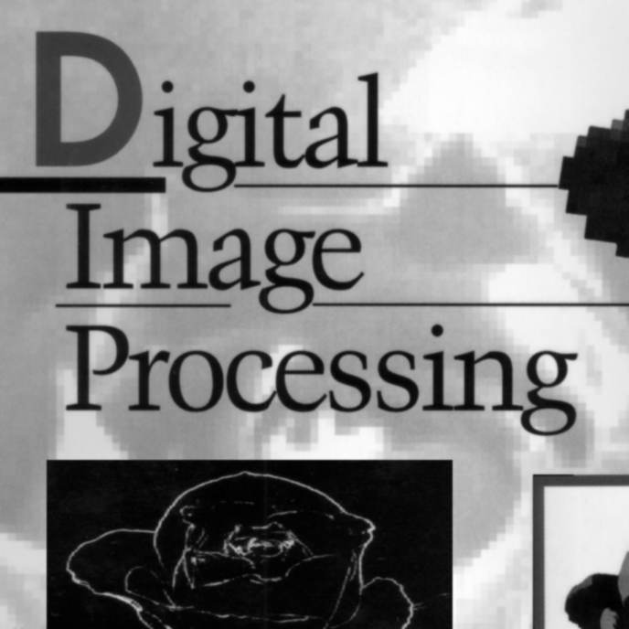

<b>数字图像处理及应用 第4次作业</b>

<b>组号： <u>16</u>&emsp;小组成员： <u>冯坤龙 郝锦阳 朱从庆 辛梓阳 徐振良</u></b>

<b>Part I Exercises</b>

***

**Ex.1** The image shown in FIGURE 1 consists of two infinitesimally thin white lines on a black background, intersecting at some point in the image. The image is input into a linear, position invariant system with the impulse response given as Eq.1.
$$
h(x,y)=e^{-[(x-\alpha)^2+(y-\beta)^2]} \tag{1}
$$
Assuming continuous variables and negligible noise, find an expression for the output image $g(x,y)$. 

<b>FIGURE 1</b>

**Answer:**

***

**Ex.2** During acquisition, an image undergoes uniform linear motion in the vertical direction for a time $T_1$. The direction of motion then switches to the horizontal direction for a time interval $T_2$. Assuming that the time it takes the image to change directions is negligible, and that shutter opening and closing times are negligible also, give an expression for the blurring function, $H(u,v)$.

**Answer:**

***

**Ex.3** 

(**a**) The image in (b) and (c) were obtained by inverse and Wiener-filtering the image in (a), which is a motion blurred image that, in addition, is corrupted by additive Gaussian noise. The blurring itself is corrected in (b) and (c). However, the restored image (b) has a strong streak pattern that is not apparent in (a) [for example, compare the area of constant white in the top right of (b) with the corresponding are in (a).] On the other hand, the streak pattern does not appear in (c). Explain how this pattern originated and why Wiener filter can avoid it.

<table frame=void rules=none>
<tr>
    <td style="border:none;">

</td>
    <td style="border:none;">

</td>
    <td style="border:none; border-collapse:collapse;">

</td>
</tr>
<tr>
    <td style="border: none;">
(<b>a</b>)
</td>
    <td style="border: none;">
(<b>b</b>)
</td>
    <td style="border: none;">
(<b>c</b>)
</td>  
</tr>
</table>

<b>FIGURE 2 Inverse and Wiener filtering</b>

**Answer:**

***

**Ex.4** A certain X-ray imaging geometry produces a blurring degradation that can be modeled as the convolution of the sensed image with the spatial, circularly symmetric function
$$
h(x,y)=\frac{x^2+y^2-2\sigma^2}{\sigma^4}e^{-\frac{x^2+y^2}{2\sigma^2}} \tag{2}
$$
Assuming continuous variables, show that the degradation in the frequency domain is given by the expression
$$
H(u,v)=-8\pi^3\sigma^2(u^2+v^2)e^{-2\pi^2\sigma^2(u^2+v^2)} \tag{3}
$$
**Answer:**

***

**Ex.5** The image shown is a blurred, 2-D projection of a volumetric rendition of a heart. It is known that each of the cross hairs on the right bottom part of the image was 4 pixels wide, 20 pixels long, and had an intensity value of 255 before blurring. Provide a step-by-step procedure indicating how you would use the information just given to obtain the blurring function $H(u,v)$.

<b>FIGURE 3 Volumetric rendition of a heart</b>

**Answer:**

***

**Ex.6** Explain the reason for the formation of image (d) in FIGURE 4 (refer to Example 4.6 in page 252)，which is acquired by an imaging system with maximum sampling rate of $96\times 96$. The original image of (d) is a checkerboard like image, which each of its square is of $0.4798\times 0.4798$ pixels.

<b>FIGURE 4 Aliasing in image</b>

<b>Part II Programming</b>

***

**1.** The arithmetic mean filter is defined as
$$
\hat{f}(x,y)=\frac{1}{mn}\sum\limits_{(s,t)\in S_{xy}}g(s,t).
$$
The white bars in the test pattern shown are 7 pixels wide and 210 pixels high. The separation between bars is 17 pixels. What would this image look like after application of

(**a**) A $3\times 3$ arithmetic mean filter?
(**b**) A $7\times 7$ arithmetic mean filter?
(**c**) A $9\times 9$ arithmetic mean filter? 

<b>FIGURE 5 Test pattern</b>

(*followed by  **Matlab live Scripts**  or **Jupyter Scripts** and running results*)

**2.**   Repeat **1** using a geometric mean filter which is defined as 
$$
\hat{f}(x,y)=\left[\prod_{(s,t)\in{S_{xy}}}g(s,t)\right]^\frac{1}{mn}.
$$
(*followed by **Matlab live Scripts** or **Jupyter Scripts** and running results*)

**3.**   Repeat **1** using a harmonic mean filter which is defined as 
$$
\hat{f}(x,y)=\frac{mn}{\sum\limits_{(s,t)\in{S_{xy}}}\frac{1}{g(s,t)}}.
$$

(*followed by **Matlab live Scripts** or **Jupyter Scripts** and running results*)

**4.**  Sketch what the image in FIGURE 6 would look like if it were blurred using the transfer function
$$
H(u,v)=\frac{T}{\pi(ua+vb)}sin[\pi(ua+vb)]e^{-j\pi(ua+vb)}
$$
(**a**) With $a=b=0.1$, and $T=1$.

(**b**) In addition, add Gaussian noise into the resulting image of (a), with zero mean and variance of 650.

<b>FIGURE 6</b>

Try to restore the degraded image after procedure (b) using inverse filter, Wiener filter, and constrained least squares filter.

(*followed by  **Matlab live Scripts**  or **Jupyter Scripts** and running results*)

