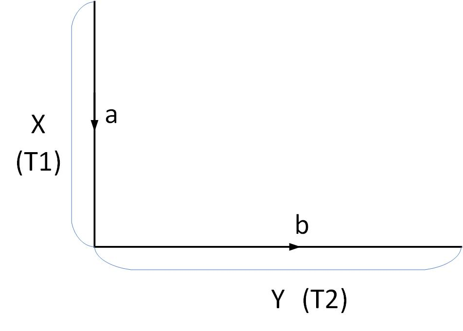

<b>数字图像处理及应用 第4次作业</b>

<b>组号： <u>16</u>&emsp;小组成员： <u>冯坤龙 郝锦阳 朱从庆 辛梓阳 徐振良</u></b>

<b>Part I Exercises</b>

***

**Ex.1** The image shown in FIGURE 1 consists of two infinitesimally thin white lines on a black background, intersecting at some point in the image. The image is input into a linear, position invariant system with the impulse response given as Eq.1.
$$
h(x,y)=e^{-[(x-\alpha)^2+(y-\beta)^2]} \tag{1}
$$
Assuming continuous variables and negligible noise, find an expression for the output image $g(x,y)$. 

<b>FIGURE 1</b>

**Answer:**

we know that: this image can be modeled to:
$$
f(x,y)=\delta(x-a)+\delta(y-b)
$$
so, we can get that:
$$
F(u,v)=2\pi\delta(v)e^{-j2\pi ua}+2\pi\delta(u)e^{-j2\pi vb}
$$
since $h(x,y)=e^{-[(x-\alpha)^2+(y-\beta)^2]} \tag{1}$ :
$$
\begin{array}{l}
H(u,v)&=\sqrt\pi e^{-\pi ^2u^2}e^{-j2\pi u\alpha}\sqrt\pi e^{-\pi ^2v^2}e^{-j2\pi v\beta}\\
\end{array}
$$
and:
$$
\begin{array}{l}
G(u,v) &= F(u,v)H(u,v)\\
&=\sqrt\pi e^{-\pi ^2u^2}e^{-j2\pi u(\alpha+a)}\sqrt\pi e^{-\pi ^2v^2}e^{-j2\pi v\beta}2\pi \delta(v)+\sqrt\pi e^{-\pi ^2v^2}e^{-j2\pi v(\beta+b)}\sqrt\pi e^{-\pi ^2u^2}e^{-j2\pi u\alpha}2\pi \delta(u)
\end{array}
$$

for what we want $g(x,y)$ = $\mathscr{F}^{-1}[G(u,v)]$ :
$$
\begin{array}{l}
g(x,y)&=\int_{-\infty}^{+\infty}2\pi \delta(v)\sqrt\pi e^{-\pi^2v^2}e^{-j2\pi v\beta}e^{j2\pi vy}dv\int_{-\infty}^{+\infty}\sqrt\pi e^{-\pi^2u^2}e^{-j2\pi u(\alpha+a)}e^{j2\pi ux}du\\
&+\int_{-\infty}^{+\infty}2\pi \delta(u)\sqrt\pi e^{-\pi^2u^2}e^{-j2\pi u\alpha}e^{j2\pi ux}du\int_{-\infty}^{+\infty}\sqrt\pi e^{-\pi^2v^2}e^{-j2\pi v(\beta+b)}e^{j2\pi vy}dv\\
&=\sqrt\pi e^{-[x-(\alpha+a)^2]}+\sqrt\pi e^{-[y-(\beta+b)^2]}\\
&=\sqrt\pi\{e^{-[x-(\alpha+a)^2]}+e^{-[y-(\beta+b)^2]}\}
\end{array}
$$
so we can know the finally answer is:
$$
\begin{array}{l}
&g(x,y)=\sqrt\pi\{e^{-[x-(\alpha+a)^2]}+e^{-[y-(\beta+b)^2]}\}
\end{array}
$$

***

**Ex.2** During acquisition, an image undergoes uniform linear motion in the vertical direction for a time $T_1$. The direction of motion then switches to the horizontal direction for a time interval $T_2$. Assuming that the time it takes the image to change directions is negligible, and that shutter opening and closing times are negligible also, give an expression for the blurring function, $H(u,v)$.

**Answer:**

First down, then to the right, and at constant velocity, you get

In vertical direction
$$
X(t) = \left\{\begin{array}{left}
a/T_1\cdot t,   & 0\le t \le T_1 \\
a,   & t >T_1 \\
\end{array}{}\right.
$$

In horizontal direction
$$
Y(t) = \left\{\begin{array}{left}
b/T_2\cdot(t-T_1),   &T_1< t \le T_2 \\
0,   & 0\le t \le T_1 \\
\end{array}{}\right.
$$

With the formula  
$$
H(u,v)= \int_0^T {e^{-j2\pi[ux_o(t)+vy_0(t)]} dt}\\
$$
 we can get
$$
\begin{array}{l}
H(u,v) &=\int_0^{T_1} {e^{-j2\pi u\cdot at/T_1} dt}+ \int_{T_1}^{T_1+T_2} {e^{-j2\pi[ua+v\cdot b(t-T_1)/T_2]} dt}\\
  &= \dfrac{1}{-j2\pi ua/T_1}\cdot[e^{-j2\pi uat/T_1}]^{T_1}_0+\dfrac{1}{-j2\pi bv/T_2}\cdot[e^{-j2\pi vbt/T_2}]^{T_1+T_2}_{T_1}\cdot e^{-j2\pi[ua-bT_1/T_2]}\\
  &= \dfrac{e^{-j2\pi ua}-1}{-j2\pi ua/T_1}+\dfrac{e^{-j2\pi(ua+vb)}-e^{-j2\pi ua}}{-j2\pi vb/T_2}\\
  &= e^{-jua\pi}\sin(\pi ua)\dfrac{T_1}{\pi ua}+e^{-j2\pi ua}e^{-jvb\pi}\sin(\pi vb)\dfrac{T_2}{\pi vb}\\
\end{array}{}
$$

***

**Ex.3** 

(**a**) The image in (b) and (c) were obtained by inverse and Wiener-filtering the image in (a), which is a motion blurred image that, in addition, is corrupted by additive Gaussian noise. The blurring itself is corrected in (b) and (c). However, the restored image (b) has a strong streak pattern that is not apparent in (a) [for example, compare the area of constant white in the top right of (b) with the corresponding are in (a).] On the other hand, the streak pattern does not appear in (c). Explain how this pattern originated and why Wiener filter can avoid it.

<table frame=void rules=none>
<tr>
    <td style="border:none;">

</td>
    <td style="border:none;">

</td>
    <td style="border:none; border-collapse:collapse;">

</td>
</tr>
<tr>
    <td style="border: none;">
(<b>a</b>)
</td>
    <td style="border: none;">
(<b>b</b>)
</td>
    <td style="border: none;">
(<b>c</b>)
</td>  
</tr>
</table>

<b>FIGURE 2 Inverse and Wiener filtering</b>

**Answer:**

If you use inverse filtering, there will be:
$$
\widehat{F}(u,v)=\dfrac{G(u,v)}{H(u,v)}=F(u,v)+\dfrac{N(u,v)}{H(u,v)}
$$
It is easy to see that when H(u,v) is small, it amplifies the effect of noise, so it will have a different effect, if Wiener filter is used, it will have:
$$
\begin{array}{l}
\widehat{F}(u,v) &=[\dfrac{1}{H(u,v)}\cdot\dfrac{|H(u,v)|^2}{|H(u,v)|^2+K}]\cdot G(u,v)\\
&=\dfrac{G(u,v)}{H(u,v)}\cdot\dfrac{|H(u,v)|^2}{|H(u,v)|^2+K}\\
&=[F(u,v)+\dfrac{N(u,v)}{H(u,v)}]\cdot \dfrac{|H(u,v)|^2}{|H(u,v)|^2+K}
\end{array}{}
$$
Therefore, when H(u,v) is very small, the effect of noise amplified by H(u,v) is attenuated, so as to avoid this phenomenon

***

**Ex.4** A certain X-ray imaging geometry produces a blurring degradation that can be modeled as the convolution of the sensed image with the spatial, circularly symmetric function
$$
h(x,y)=\frac{x^2+y^2-2\sigma^2}{\sigma^4}e^{-\frac{x^2+y^2}{2\sigma^2}} \tag{2}
$$
Assuming continuous variables, show that the degradation in the frequency domain is given by the expression
$$
H(u,v)=-8\pi^3\sigma^2(u^2+v^2)e^{-2\pi^2\sigma^2(u^2+v^2)} \tag{3}
$$
**Answer:**

We can see that from 
$$
h(x,y)=\frac{x^2+y^2-2\sigma^2}{\sigma^4}\cdot e^{\frac{-(x^2+y^2)}{2\sigma^2}}
$$
We can get:
$$
\begin{array}{l}
h(x,y) &=\dfrac{∂^2(e^{\dfrac{-(x^2+y^2)}{\sigma^2}})}{∂x^2}+\dfrac{∂^2(e^{\dfrac{-(x^2+y^2)}{2\sigma^2}})}{∂y^2}\\
&=\dfrac{x^2-\sigma^2}{\sigma^4}+\dfrac{y^2-\sigma^2}{\sigma^4}\\
&=\dfrac{x^2+y^2-2\sigma^2}{\sigma^4}
\end{array}{}
$$
Let's say 
$$
f(x,y)=e^{-\frac{x^2+y^2}{2\sigma^2}}
$$
From the knowledge of the previous chapter:
$$
\frac{∂^2f(x,y)}{∂x^2}+\frac{∂^2f(x,y)}{∂y^2}\Longleftrightarrow-4\pi^2(u^2+v^2)F(u,v)
$$
And then
$$
F(u,v)=2\pi\sigma^2e^{-2\pi\sigma^2(u^2+v^2)}
$$
Therefore
$$
\begin{array}{l}
h(x,y)\Longleftrightarrow H(u,v) &=-4\pi^2(u^2+v^2)\cdot2\pi\sigma^2e^{-2\pi\sigma^2(u^2+v^2)}\\
&=-8\pi^3\sigma^2(u^2+v^2)e^{-2\pi^2\sigma^2(u^2+v^2)}
\end{array}{}
$$
H(u,v) as shown in the figure

***

**Ex.5** The image shown is a blurred, 2-D projection of a volumetric rendition of a heart. It is known that each of the cross hairs on the right bottom part of the image was 4 pixels wide, 20 pixels long, and had an intensity value of 255 before blurring. Provide a step-by-step procedure indicating how you would use the information just given to obtain the blurring function $H(u,v)$.

<b>FIGURE 3 Volumetric rendition of a heart</b>

**Answer:**

Firstly, according to the linear space invariant system is completely represented by its impulse response, we only need to observe a transformation of the whole image, then we can estimate the fuzzy image $H(u,v)$ of the whole image through the fuzzy function $H'(u,v)$.Since the subject has accurate image information before the crosshair blur, set $g(x,y)$, and set $g'(x,y)$ after the blur. The Fourier transform corresponding to the frequency domain gives you $G(u,v)$ and $G'(u,v)$. Then the approximate fuzzy function can be estimated in terms of 
$$
H(u,v)=\frac{G'(u,v)}{G(u,v)}
$$

***

**Ex.6** Explain the reason for the formation of image (d) in FIGURE 4 (refer to Example 4.6 in page 252)，which is acquired by an imaging system with maximum sampling rate of $96\times 96$. The original image of (d) is a checkerboard like image, which each of its square is of $0.4798\times 0.4798$ pixels.

<b>FIGURE 4 Aliasing in image</b>

**Answer:**

For image of d, we need at least more than 200 sampling points, so aliasing will occur theoretically. In this case, the aliased result looks like a normal checkerboard pattern. In fact, this image would result from sampling a checker- board image whose squares were 12 pixels on the side. Thus, the situation shown in Figure d occurs

<b>Part II Programming</b>

***

**1.** The arithmetic mean filter is defined as
$$
\hat{f}(x,y)=\frac{1}{mn}\sum\limits_{(s,t)\in S_{xy}}g(s,t).
$$
The white bars in the test pattern shown are 7 pixels wide and 210 pixels high. The separation between bars is 17 pixels. What would this image look like after application of

(**a**) A $3\times 3$ arithmetic mean filter?
(**b**) A $7\times 7$ arithmetic mean filter?
(**c**) A $9\times 9$ arithmetic mean filter? 

<b>FIGURE 5 Test pattern</b>

(*followed by  **Matlab live Scripts**  or **Jupyter Scripts** and running results*)

**2.**   Repeat **1** using a geometric mean filter which is defined as 
$$
\hat{f}(x,y)=\left[\prod_{(s,t)\in{S_{xy}}}g(s,t)\right]^\frac{1}{mn}.
$$
(*followed by **Matlab live Scripts** or **Jupyter Scripts** and running results*)

**3.**   Repeat **1** using a harmonic mean filter which is defined as 
$$
\hat{f}(x,y)=\frac{mn}{\sum\limits_{(s,t)\in{S_{xy}}}\frac{1}{g(s,t)}}.
$$

(*followed by **Matlab live Scripts** or **Jupyter Scripts** and running results*)

**4.**  Sketch what the image in FIGURE 6 would look like if it were blurred using the transfer function
$$
H(u,v)=\frac{T}{\pi(ua+vb)}sin[\pi(ua+vb)]e^{-j\pi(ua+vb)}
$$
(**a**) With $a=b=0.1$, and $T=1$.

(**b**) In addition, add Gaussian noise into the resulting image of (a), with zero mean and variance of 650.

<b>FIGURE 6</b>

Try to restore the degraded image after procedure (b) using inverse filter, Wiener filter, and constrained least squares filter.

(*followed by  **Matlab live Scripts**  or **Jupyter Scripts** and running results*)

