<<<<<<< HEAD

<b>数字图像处理及应用 第5次作业</b>

<b>组号： <u>XX（两位数字）</u>&emsp;小组成员： <u>（列出所有小组成员，成员姓名间用1个空格间隔）</u></b>

<b>Part I Exercises</b>

***

**Ex.1**  Let A denote the set shown shaded in the following figure, and refer to the structuring elements shown (the black dots denote the origin). Sketch the result of the following operations:
(**a**) $\left( A \ominus B^4 \right) \oplus B^2$.
(**b**) $\left( A \ominus B^1 \right) \oplus B^3$.
(**c**) $\left( A \oplus B^1 \right) \oplus B^3$.

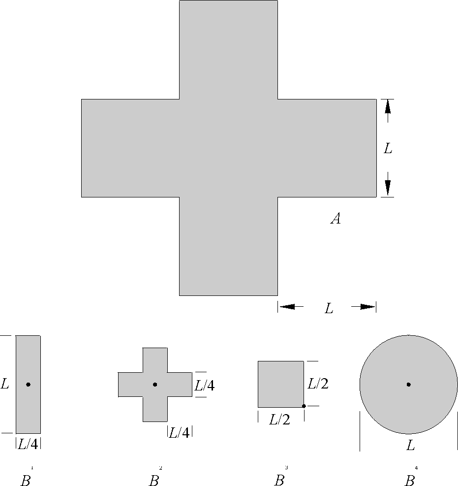

<b>FIGURE 1 Image and structure elements</b>

**Answer:**

(a)

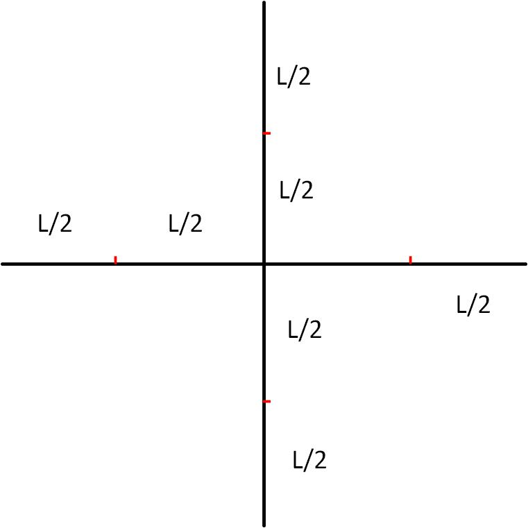

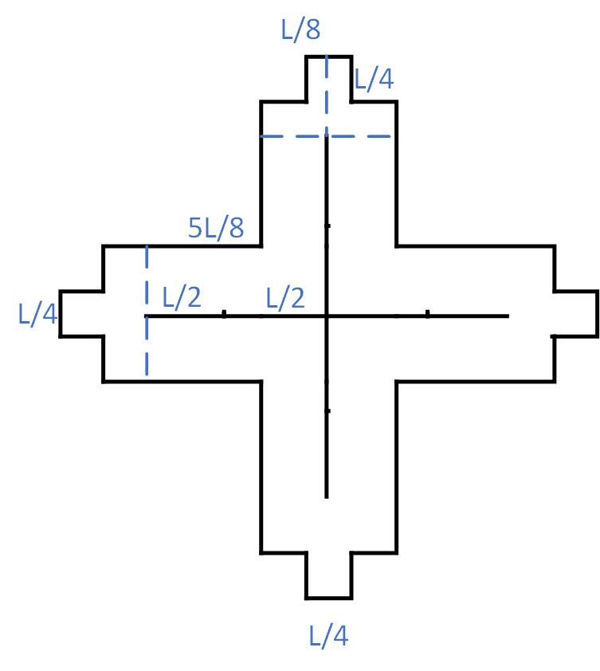

(b)

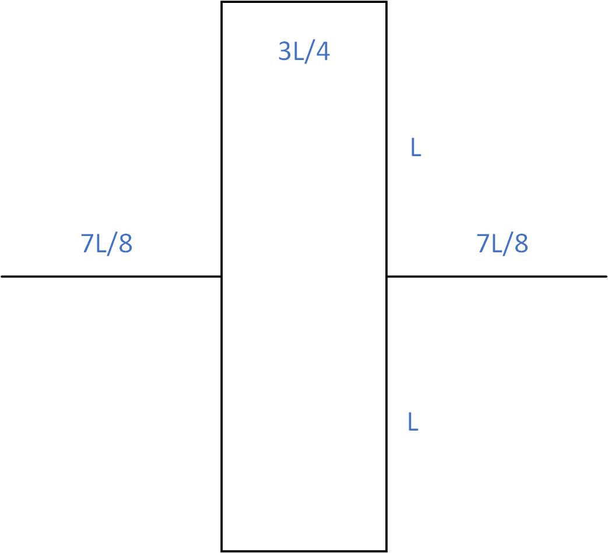

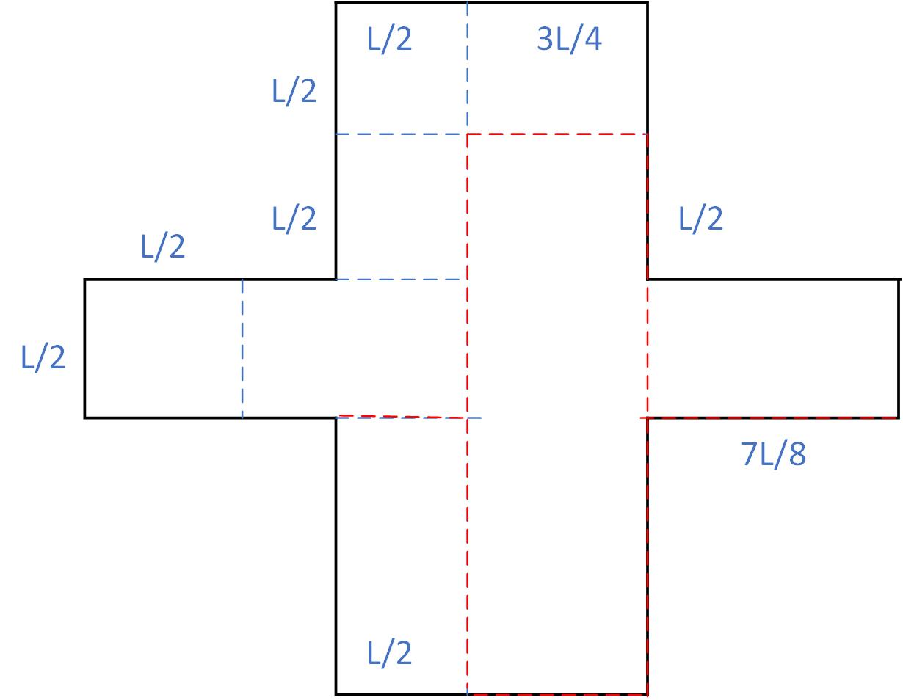

(c)

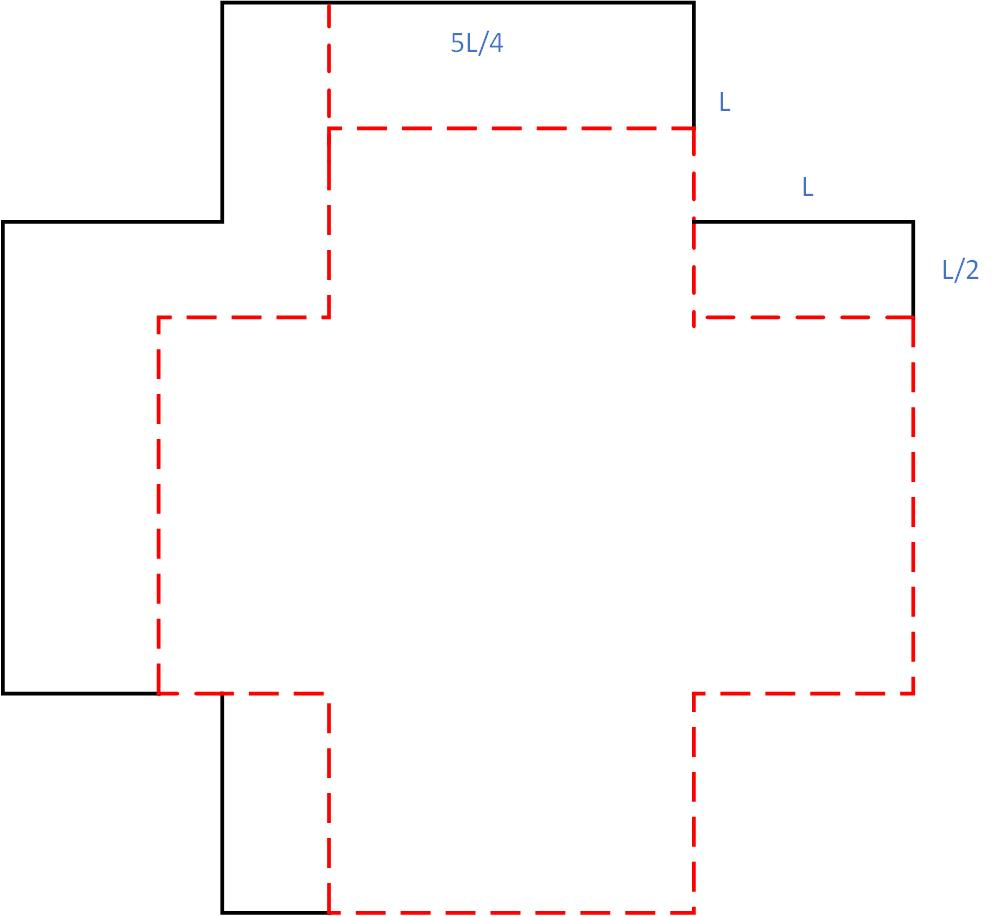

***

**Ex.2** Prove the validity of the following expressions:
(**a**) $A\circ B$ is a subset (subimage) of $A$.
(**b**) If $C$ is a subset of $D$, the $C\circ B$ is a subset of $D\circ B$.
(**c**) $(A\circ B)\circ B = A\circ B$.

**Answer:**

(a)Because
$$
(B)_z\subseteq A,A\circ B=\cup \{(B)_z\vert(B)_z\subseteq A\}
$$
We can conclude that A o B is a subset of A.

(b)From the definition of opening operation we know
$$
C\circ B=\cup\{(B)_z\vert(B)_z\subseteq C\}
$$

$$
D\circ B=\cup\{(B)_z\vert(B)_z\subseteq D\}
$$

If C is subset of D,the C o B is a subset of D o B

(c)
$$
(A\circ B)\circ B=[(A\ominus B\oplus B)\ominus B]\oplus B=[(A\ominus B)\cdot B]\oplus B
$$

And
$$
(A\ominus B)\cdot B \supseteq(A\ominus B)
$$

$$
(A\ominus B)\oplus B \supseteq(A\ominus B)
$$

$$
\Longrightarrow(A\circ B)\circ B\subseteq A\circ B
$$

Because
$$
A\circ B\subseteq(A\circ B)\circ B
$$

We can get
$$
(A\circ B)\circ B=A\circ B
$$

***

**Ex.3** 

(**a**) Give a morphological algorithm for converting an 8-connected binary boundary to an m-connected boundary. You may assume that the boundary is fully connected and that it is one pixel thick. 
(**b**) Does the operation of your algorithm require more than one iteration with each structuring element? Explain your reasoning.
(**c**) Is the performance of your algorithm independent of the order in which the structuring elements are applied? If your answer is yes, prove it; otherwise give an example that illustrates the dependence of your procedure on the order of application of the structuring elements.

**Answer:**

(a) A is the input image containing the boundary
$$
X_1=A\otimes B_1 \\
Y_1=A\cap X_1^c \\
X_2=Y_1\otimes B_2 \\
Y_2=Y_1\cap X_2^c \\
X_3=Y_2\otimes B_3 \\
Y_3=Y_2\cap X_3^c \\
X_4=Y_3\otimes B_4 \\
Y_4=Y_3\cap X_4^c \\
$$

(b)Only one iteration is required. Application of the hit-or-miss transform using a given Bi finds all instances of occurrence of the pattern described by that structuring element. 

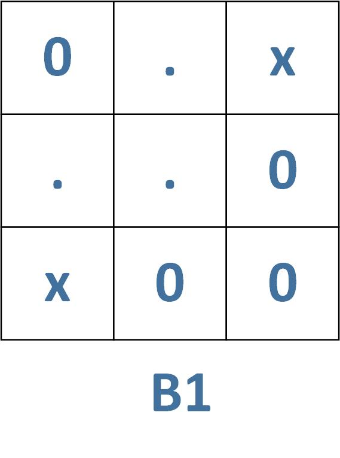

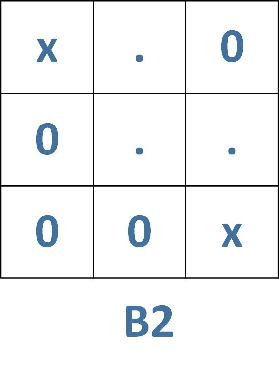

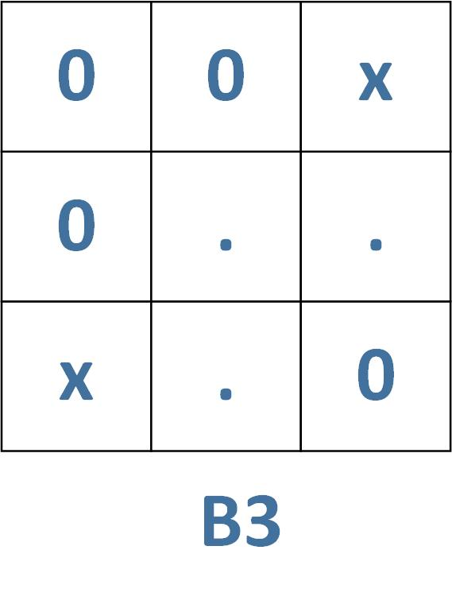

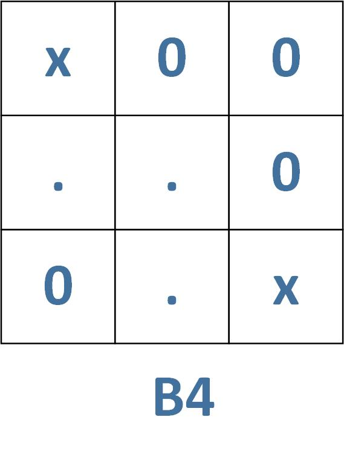

（c）The order is important. The algorithm independent of the order in which the structuring elements are applied.

***

**Ex.4** The rectangle in the binary image in FIGURE 2 is of size $m\times n$ pixels.
(**a**) What would the magnitude of the gradient of this image look like based on using the approximation given in Eq. (1)?
$$
M(x,y)\approx |g_x|+|g_y| \tag{1}
$$
 Assume that $g_x$ and $g_y$ are obtained using the Sobel operators. Show all relevant different pixel values in the gradient image.
(**b**) Sketch the histogram of edge directions computed using Eq. (2). Be precise in labeling the height of each component of the histogram.
$$
\alpha(x,y)=\arctan\left[\frac{g_y}{g_x}\right] \tag{2}
$$
(**c**) What would the Laplacian of this image look like based on using the approximation in Eq. (3)? Show all relevant different pixel values in the Laplacian image.
$$
\nabla^2f(x,y)=f(x+1,y)+f(x-1,y)+f(x,y+1)+f(x,y-1)-4f(x,y) \tag{3}
$$

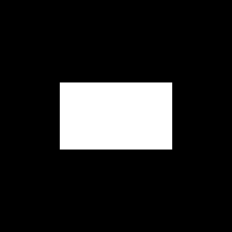

<b>FIGURE 2 A binary image of size m &times n </b>

**Answer:**

(a)The intensity of this binary image is shown in Fingure a.

!
$$
Figure\ a
$$
Through the calculation of Sobel operator and Equ.1,the magnitude of this image can be obtained, as shown in Figure b.

$$
Figure\ b
$$
(b)From $g_x$,$g_y$ and Equ.(2),after calculate we can get the angle value and quantities.We list them shown below.

(c)The Laplacian's spatial mask and pixel values of this image by Laplacian are shown below.

***

**Ex.5** Marr and Hildreth noted that it is possible to approximate the LoG filter in Eq.(4) by a difference of Gaussians (DoG) in Eq.(5):
$$
\nabla^2G(x,y)=\left[\frac{x^2+y^2-2\sigma^2}{\sigma^4}\right]e^{-\frac{x^2+y^2}{2\sigma^2}} \tag{4}
$$

$$
\rm DoG(x,y)=\frac{1}{2\pi\sigma_1^2}e^{-\frac{x^2+y^2}{2\sigma_1^2}}-\frac{1}{2\pi\sigma_2^2}e^{-\frac{x^2+y^2}{2\sigma_2^2}} \tag{5}
$$
with $\sigma_1 >\sigma_2$. To make meaningful comparisons between the LoG and DoG, the value of $\sigma$ for the LoG must be selected as in the Eq.(6) so that the LoG and DoG have the same zero crossings,
$$
\sigma^2=\frac{\sigma_1^2 \sigma_2^2}{\sigma_1^2-\sigma_2^2}\ln\left[\frac{\sigma_1^2}{\sigma_2^2}\right] \tag{6}
$$
(**a**) Derive Eq. (6).
(**b**) Let $k ={\sigma_1}/{\sigma_2}$ denote the standard deviation ratio discussed in connection with the DoG function, and express Eq. (6) in terms of $k$ and $\sigma_2$.

**Answer:**

(a) Let Eq.(5)=0  ==>
$$
\frac{1}{2\pi\sigma_1^2}e^{-\frac{x^2+y^2}{2\sigma_1^2}}=\frac{1}{2\pi\sigma_2^2}e^{-\frac{x^2+y^2}{2\sigma_2^2}} \tag{5} \\
\ln(\frac{1}{2\pi\sigma_1^2})-\frac{x^2+y^2}{2\sigma_1^2}=\ln(\frac{1}{2\pi\sigma_2^2}){-\frac{x^2+y^2}{2\sigma_2^2}} \\
\ln(\frac{1}{2\pi\sigma_1^2})-\ln(\frac{1}{2\pi\sigma_2^2})=\frac{x^2+y^2}{2\sigma_1^2}{-\frac{x^2+y^2}{2\sigma_2^2}} \\
\ln(\frac{1}{2\pi\sigma_1^2})-\ln(\frac{1}{2\pi\sigma_2^2})=(x^2+y^2)(\frac{1}{2\sigma_1^2}{-\frac{1}{2\sigma_2^2}}) \\
$$
Let Eq.(4)=0 ==>
$$
x^2+y^2=2\sigma^2
$$
From the above equation, it can be concluded that
$$
\ln(\frac{1}{2\pi\sigma_1^2})-\ln(\frac{1}{2\pi\sigma_2^2})=\sigma^2(\frac{1}{\sigma_1^2}{-\frac{1}{\sigma_2^2}}) \\
\sigma^2=\frac{\ln(\frac{1}{2\pi\sigma_1^2}) -\ln(\frac{1}{2\pi\sigma_2^2})}{(\frac{1}{\sigma_1^2}{-\frac{1}{\sigma_2^2}})}=\frac{\ln(\frac{\sigma^2_2}{\sigma^2_1})}{\frac{1}{\sigma^2_1}-\frac{1}{\sigma^2_2}}=\frac{\sigma^2_1\sigma^2_2}{\sigma^2_1-\sigma^2_1}ln[\frac{\sigma^2_1}{\sigma^2_1}]
$$

(b) let
$$
\begin{align*} \\
\sigma_1=&k\sigma_2,(k>1) \\
\sigma^2=&\frac{k^2\sigma^4_2}{k^2\sigma^2_2-\sigma^2_2}\ln[\frac{k^2\sigma^2_2}{\sigma^2_2}] \\
=&\frac{k^2}{k^2-1}\sigma^2_2\ln(k^2)
\end{align*} \\
$$

***

**Ex.6** An important area of application for image segmentation techniques is in processing images resulting from so-called *bubble chamber* events. These images arise from experiments in high-energy physics in which a beam of particles of known properties is directed onto a target of known nuclei. A typical event consists of incoming tracks, any one of which, in the event of a collision, branches out into secondary tracks of particles emanating from the point of collision. Propose a segmentation approach for detecting all tracks angled at any of the following six directions off the horizontal: $\pm 25^{\circ}$, $\pm 50^{\circ}$, and $\pm 75^{\circ}$. The allowed estimation error in any of these six directions is $\pm 5^{\circ}$. For a track to be valid it must be at least 100 pixels long and have no more than three gaps, each not exceeding 10 pixels. You may assume that the images have been preprocessed so that they are binary and that all tracks are 1 pixel thick, except at the point of collision from which they emanate. Your procedure should be able to differentiate between tracks that have the same direction but different origins. (**Hint: Base your solution on the Hough transform.**)

**Answer:**

First, the axis is divided into six subregions corresponding to the Angle between the orbit and the horizontal direction in six directions. Since the maximum is PI, the range is PI.
Secondly, the axis ranges in$[-\sqrt{2D},\sqrt{2D}]$

The axis requires subtle partitioning to distinguish trajectories with the same direction but different starting points.
Finally, the Hough transform can be used as a "filter" to divide all the points in the image into six groups, categorized according to six directions. Then test whether the trajectories meet the requirements of the problem according to different groups.

<b>Part II Programming</b>

***

**1.** Refer to the image and the disk structuring element shown in FIGURE 3. Sketch what the sets $C$, $D$, $E$, and $F$ would look like for the following sequence of operations: 

a) $C=A\ominus B$;

b) $D=C\oplus B$;

c) $E=D\oplus B$;

d) $F=E\ominus B$.

Set $A$ consists of all the foreground pixels (white), except the structuring element, $B$, which you may assume is just large enough to encompass any of the random elements in the image. Note that the sequence of operations above is simply the opening of $A$ by $B$ followed by a closing of the result by $B$.

<b>FIGURE 3 Image and the disk structuring element</b>

(*followed by  **Matlab live Scripts**  or **Jupyter Scripts** and running results*)

**2.**   Consider the image in FIGURE 4, which shows a region of small circles enclosed by a region of larger circles.
(**a**) Give a morphologic algorithm to partition the image into two parts, in which one contains small circles and another contains larger circles. You can make any assumptions that you need to make for the method to work.
(**b**) Sketch the result in each step of your algorithm.

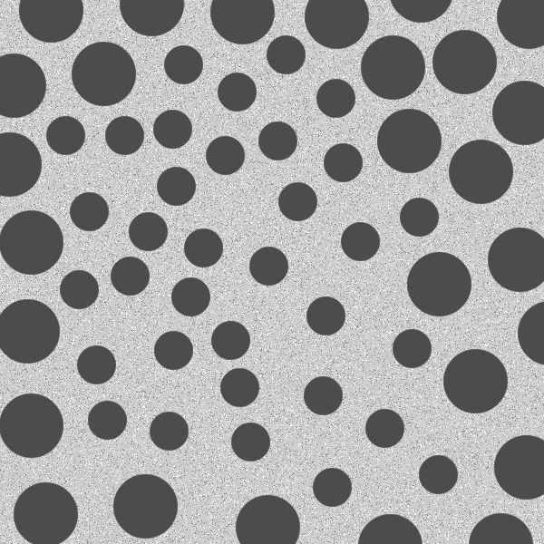

<b>FIGURE 4</b>

(*followed by **Matlab live Scripts** or **Jupyter Scripts** and running results*)

**3.**   The objects and background in FIGURE 5 have a mean intensity of 170 and 60, respectively, on a [0, 255] scale. The image is corrupted by Gaussian noise with 0 mean and a standard deviation of 10 intensity levels. 

(**a**) Segment the image based on thresholding (Refer to Example 10.15 in textbook, and pay attention to the choice of initial threshold $T$).

(**b**) Repeat segmentation based on region growing. (**Optional**)

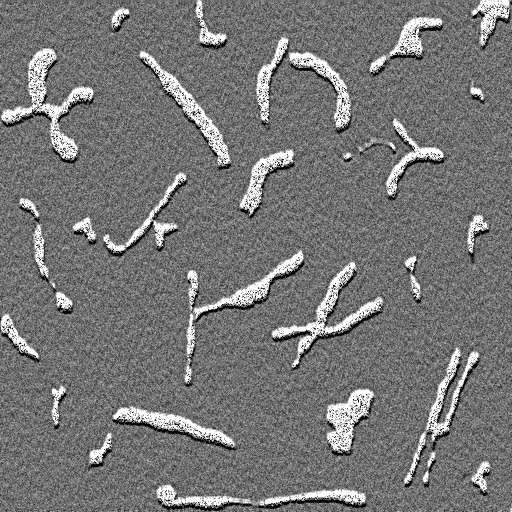

<b>FIGURE 5</b>

(*followed by **Matlab live Scripts** or **Jupyter Scripts** and running results*)
=======

<b>数字图像处理及应用 第5次作业</b>

<b>组号： <u>XX（两位数字）</u>&emsp;小组成员： <u>（列出所有小组成员，成员姓名间用1个空格间隔）</u></b>

<b>Part I Exercises</b>

***

**Ex.1**  Let A denote the set shown shaded in the following figure, and refer to the structuring elements shown (the black dots denote the origin). Sketch the result of the following operations:
(**a**) $\left( A \ominus B^4 \right) \oplus B^2$.
(**b**) $\left( A \ominus B^1 \right) \oplus B^3$.
(**c**) $\left( A \oplus B^1 \right) \oplus B^3$.

<b>FIGURE 1 Image and structure elements</b>

**Answer:**

(a)

(b)

(c)

***

**Ex.2** Prove the validity of the following expressions:
(**a**) $A\circ B$ is a subset (subimage) of $A$.
(**b**) If $C$ is a subset of $D$, the $C\circ B$ is a subset of $D\circ B$.
(**c**) $(A\circ B)\circ B = A\circ B$.

**Answer:**

(a)Because
$$
(B)_z\subseteq A,A\circ B=\cup \{(B)_z\vert(B)_z\subseteq A\}
$$
We can conclude that A o B is a subset of A.

(b)From the definition of opening operation we know
$$
\begin{array}{l}
C\circ B=\cup\{(B)_z\vert(B)_z\subseteq C\}\\
D\circ B=\cup\{(B)_z\vert(B)_z\subseteq D\}
\end{array}
$$

If $C$ is subset of $D$,the $C \circ B$ is a subset of $D \circ B$

(c)
$$
(A\circ B)\circ B=[(A\ominus B\oplus B)\ominus B]\oplus B=[(A\ominus B)\cdot B]\oplus B
$$

And
$$
(A\ominus B)\bullet B \supseteq(A\ominus B)
$$

$$
(A\ominus B)\oplus B \supseteq(A\ominus B)
$$

$$
\Longrightarrow(A\circ B)\circ B\subseteq A\circ B
$$

Because
$$
A\circ B\subseteq(A\circ B)\circ B
$$

We can get
$$
(A\circ B)\circ B=A\circ B
$$

***

**Ex.3** 

(**a**) Give a morphological algorithm for converting an 8-connected binary boundary to an m-connected boundary. You may assume that the boundary is fully connected and that it is one pixel thick. 
(**b**) Does the operation of your algorithm require more than one iteration with each structuring element? Explain your reasoning.
(**c**) Is the performance of your algorithm independent of the order in which the structuring elements are applied? If your answer is yes, prove it; otherwise give an example that illustrates the dependence of your procedure on the order of application of the structuring elements.

**Answer:**

(a) A is the input image containing the boundary
$$
X_1=A\otimes B_1 \\
Y_1=A\cap X_1^c \\
X_2=Y_1\otimes B_2 \\
Y_2=Y_1\cap X_2^c \\
X_3=Y_2\otimes B_3 \\
Y_3=Y_2\cap X_3^c \\
X_4=Y_3\otimes B_4 \\
Y_4=Y_3\cap X_4^c \\
$$

(b)Only one iteration is required. Application of the hit-or-miss transform using a given Bi finds all instances of occurrence of the pattern described by that structuring element. 

（c）The order is important. The algorithm independent of the order in which the structuring elements are applied.

***

**Ex.4** The rectangle in the binary image in FIGURE 2 is of size $m\times n$ pixels.
(**a**) What would the magnitude of the gradient of this image look like based on using the approximation given in Eq. (1)?
$$
M(x,y)\approx |g_x|+|g_y| \tag{1}
$$
 Assume that $g_x$ and $g_y$ are obtained using the Sobel operators. Show all relevant different pixel values in the gradient image.
(**b**) Sketch the histogram of edge directions computed using Eq. (2). Be precise in labeling the height of each component of the histogram.
$$
\alpha(x,y)=\arctan\left[\frac{g_y}{g_x}\right] \tag{2}
$$
(**c**) What would the Laplacian of this image look like based on using the approximation in Eq. (3)? Show all relevant different pixel values in the Laplacian image.
$$
\nabla^2f(x,y)=f(x+1,y)+f(x-1,y)+f(x,y+1)+f(x,y-1)-4f(x,y) \tag{3}
$$

<b>FIGURE 2 A binary image of size m &times n </b>

**Answer:**

***

**Ex.5** Marr and Hildreth noted that it is possible to approximate the LoG filter in Eq.(4) by a difference of Gaussians (DoG) in Eq.(5):
$$
\nabla^2G(x,y)=\left[\frac{x^2+y^2-2\sigma^2}{\sigma^4}\right]e^{-\frac{x^2+y^2}{2\sigma^2}} \tag{4}
$$

$$
\rm DoG(x,y)=\frac{1}{2\pi\sigma_1^2}e^{-\frac{x^2+y^2}{2\sigma_1^2}}-\frac{1}{2\pi\sigma_2^2}e^{-\frac{x^2+y^2}{2\sigma_2^2}} \tag{5}
$$
with $\sigma_1 >\sigma_2$. To make meaningful comparisons between the LoG and DoG, the value of $\sigma$ for the LoG must be selected as in the Eq.(6) so that the LoG and DoG have the same zero crossings,
$$
\sigma^2=\frac{\sigma_1^2 \sigma_2^2}{\sigma_1^2-\sigma_2^2}\ln\left[\frac{\sigma_1^2}{\sigma_2^2}\right] \tag{6}
$$
(**a**) Derive Eq. (6).
(**b**) Let $k ={\sigma_1}/{\sigma_2}$ denote the standard deviation ratio discussed in connection with the DoG function, and express Eq. (6) in terms of $k$ and $\sigma_2$.

**Answer:**

(a) Let Eq.(5)=0  ==>
$$
\frac{1}{2\pi\sigma_1^2}e^{-\frac{x^2+y^2}{2\sigma_1^2}}=\frac{1}{2\pi\sigma_2^2}e^{-\frac{x^2+y^2}{2\sigma_2^2}} \tag{5} \\
\ln(\frac{1}{2\pi\sigma_1^2})-\frac{x^2+y^2}{2\sigma_1^2}=\ln(\frac{1}{2\pi\sigma_2^2}){-\frac{x^2+y^2}{2\sigma_2^2}} \\
\ln(\frac{1}{2\pi\sigma_1^2})-\ln(\frac{1}{2\pi\sigma_2^2})=\frac{x^2+y^2}{2\sigma_1^2}{-\frac{x^2+y^2}{2\sigma_2^2}} \\
\ln(\frac{1}{2\pi\sigma_1^2})-\ln(\frac{1}{2\pi\sigma_2^2})=(x^2+y^2)(\frac{1}{2\sigma_1^2}{-\frac{1}{2\sigma_2^2}}) \\
$$
Let Eq.(4)=0 ==>
$$
x^2+y^2=2\sigma^2
$$
From the above equation, it can be concluded that
$$
\ln(\frac{1}{2\pi\sigma_1^2})-\ln(\frac{1}{2\pi\sigma_2^2})=\sigma^2(\frac{1}{\sigma_1^2}{-\frac{1}{\sigma_2^2}}) \\
\sigma^2=\frac{\ln(\frac{1}{2\pi\sigma_1^2}) -\ln(\frac{1}{2\pi\sigma_2^2})}{(\frac{1}{\sigma_1^2}{-\frac{1}{\sigma_2^2}})}=\frac{\ln(\frac{\sigma^2_2}{\sigma^2_1})}{\frac{1}{\sigma^2_1}-\frac{1}{\sigma^2_2}}=\frac{\sigma^2_1\sigma^2_2}{\sigma^2_1-\sigma^2_1}ln[\frac{\sigma^2_1}{\sigma^2_1}]
$$

(b) let
$$
\begin{align*} \\
\sigma_1=&k\sigma_2,(k>1) \\
\sigma^2=&\frac{k^2\sigma^4_2}{k^2\sigma^2_2-\sigma^2_2}\ln[\frac{k^2\sigma^2_2}{\sigma^2_2}] \\
=&\frac{k^2}{k^2-1}\sigma^2_2\ln(k^2)
\end{align*} \\
$$

***

**Ex.6** An important area of application for image segmentation techniques is in processing images resulting from so-called *bubble chamber* events. These images arise from experiments in high-energy physics in which a beam of particles of known properties is directed onto a target of known nuclei. A typical event consists of incoming tracks, any one of which, in the event of a collision, branches out into secondary tracks of particles emanating from the point of collision. Propose a segmentation approach for detecting all tracks angled at any of the following six directions off the horizontal: $\pm 25^{\circ}$, $\pm 50^{\circ}$, and $\pm 75^{\circ}$. The allowed estimation error in any of these six directions is $\pm 5^{\circ}$. For a track to be valid it must be at least 100 pixels long and have no more than three gaps, each not exceeding 10 pixels. You may assume that the images have been preprocessed so that they are binary and that all tracks are 1 pixel thick, except at the point of collision from which they emanate. Your procedure should be able to differentiate between tracks that have the same direction but different origins. (**Hint: Base your solution on the Hough transform.**)

**Answer:**

First, the axis is divided into six subregions corresponding to the Angle between the orbit and the horizontal direction in six directions. Since the maximum is PI, the range is PI.
Secondly, the axis ranges in
$$
[-\sqrt{2D},\sqrt{2D}]
$$
The axis requires subtle partitioning to distinguish trajectories with the same direction but different starting points.
Finally, the Hough transform can be used as a "filter" to divide all the points in the image into six groups, categorized according to six directions. Then test whether the trajectories meet the requirements of the problem according to different groups.

<b>Part II Programming</b>

***

**1.** Refer to the image and the disk structuring element shown in FIGURE 3. Sketch what the sets $C$, $D$, $E$, and $F$ would look like for the following sequence of operations: 

a) $C=A\ominus B$;

b) $D=C\oplus B$;

c) $E=D\oplus B$;

d) $F=E\ominus B$.

Set $A$ consists of all the foreground pixels (white), except the structuring element, $B$, which you may assume is just large enough to encompass any of the random elements in the image. Note that the sequence of operations above is simply the opening of $A$ by $B$ followed by a closing of the result by $B$.

<b>FIGURE 3 Image and the disk structuring element</b>

(*followed by  **Matlab live Scripts**  or **Jupyter Scripts** and running results*)

**2.**   Consider the image in FIGURE 4, which shows a region of small circles enclosed by a region of larger circles.
(**a**) Give a morphologic algorithm to partition the image into two parts, in which one contains small circles and another contains larger circles. You can make any assumptions that you need to make for the method to work.
(**b**) Sketch the result in each step of your algorithm.

<b>FIGURE 4</b>

(*followed by **Matlab live Scripts** or **Jupyter Scripts** and running results*)

**3.**   The objects and background in FIGURE 5 have a mean intensity of 170 and 60, respectively, on a [0, 255] scale. The image is corrupted by Gaussian noise with 0 mean and a standard deviation of 10 intensity levels. 

(**a**) Segment the image based on thresholding (Refer to Example 10.15 in textbook, and pay attention to the choice of initial threshold $T$).

(**b**) Repeat segmentation based on region growing. (**Optional**)

<b>FIGURE 5</b>

(*followed by **Matlab live Scripts** or **Jupyter Scripts** and running results*)
>>>>>>> 22c55f842c15c7722cc96907c23efca349ed8357
